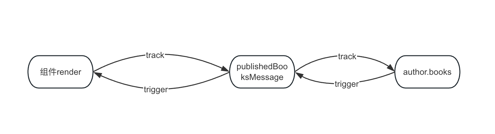

# computed

## 基本用法

```vue
<script setup>
import { reactive, computed } from 'vue'

const author = reactive({
  name: 'John Doe',
  books: ['Vue 2 - Advanced Guide']
})

// 一个计算属性 返回的是一个ref类型的变量
const publishedBooksMessage = computed(() => {
  return author.books.length > 0 ? 'Yes' : 'No'
})
</script>

<template>
  <p>Has published books:</p>
  <span>{{ publishedBooksMessage }}</span>
</template>
```

Vue 的计算属性会自动追踪响应式依赖。它会检测到 `publishedBooksMessage` 依赖于 `author.books`，所以当 `author.books` 改变时，任何依赖于 `publishedBooksMessage` 的绑定都会同时更新。

## computed特点

- 自动依赖追踪。当我们`computed`依赖的响应式数据发生变化的时候会重新计算。

- 结果会被缓存。当我们`computed`依赖的响应式数据没有发生变化的时候，无论调用多少次都会返回相同的结果。

  ```js
  const now = computed(() => Date.now())
  ```

  这也是为什么我们访问`now`这个计算属性为什么永远不会变化。

  另外由于我们结果会被缓存的原因，可以非常方便我们存储一些计算耗时非常搞的操作。这也是为什么我们需要用`computed`而不是用一个普通函数的原因。

  ```js
  // 结果不会缓存，调用一次就得计算一次
  function calculateBooksMessage() {
    return xxx; // xxx为一个耗时很长的操作
  }
  
  // 结果会缓存，只有第一次调用和依赖的响应式数据发生变化的时候才会改变
  const publishedBooksMessage = computed(() => {
    return xxx; // xxx为一个耗时很长的操作
  })
  ```

- 懒计算。不像其他的变量一样，我们的`computed`在定义的时候其实不会立马计算，只有真正的有地方调用到这个`computed`属性的时候才会执行计算。

  ```js
  const publishedBooksMessage = computed(() => {
    console.log('123');
    return author.books.length > 0 ? 'Yes' : 'No'
  })
  ```

  如果我们只是定义了这个`computed`属性，我们并不会打印出来`123`。只有调用到`publishedBooksMessage`才会真正执行。

  另外就算我们的`author.books`发生变化我们的`publishedBooksMessage`也不是立马执行，也是需要等到下一次访问的时候才会执行。

## 前置知识

首先我们需要知道我们的`computed`也是一个响应式`ref`变量，所以他是可以被其他的地方所依赖的。另外他自己本身也是会依赖其他的响应式变量的，这里的这两种依赖关系很容易搞混，我们需要特别注意。例如对于上面的例子会有如下的依赖关系图：



这里会有两种依赖关系，一个是我们组件的渲染会依赖`publishedBooksMessage`这个响应式变量，一个是我们`publishedBooksMessage`会依赖`autor.books`这个变量。

## 实现原理

### computed

```typescript
export function computed<T>(
  getterOrOptions: ComputedGetter<T> | WritableComputedOptions<T>,
  debugOptions?: DebuggerOptions,
  isSSR = false
) {
  let getter: ComputedGetter<T>
  let setter: ComputedSetter<T>

  // 1. 给geeter和setter赋值，并且判断当前computed是不是有setter属性，没有的话就是只读的
  const onlyGetter = isFunction(getterOrOptions) // 如果是函数类型说明没有传递getter，传递了getter肯定比一个对象类型
  if (onlyGetter) {
    getter = getterOrOptions
    setter = __DEV__
      ? () => {
          console.warn('Write operation failed: computed value is readonly')
        }
      : NOOP
  } else {
    getter = getterOrOptions.get
    setter = getterOrOptions.set
  }

  // 2. 调用createComputedRef函数创建computedRef
  const cRef = new ComputedRefImpl(getter, setter, onlyGetter || !setter, isSSR) // 创建computedRef变量

  // 3. 返回computedRef
  return cRef as any
}
```

可以看到我们`computed`主要做以下三件事

1. 由于我们的`computed`是重载的，支持多种调用方式，所以首先我们得判断调用类型，然后给`getter`和`setter`赋值，并且判断当前`computed`是不是有`setter`属性，没有的话就是只读的。
2. 调用`createComputedRef`函数创建`computedRef`
3. 返回`computedRef`

这里面最重要的就是调用`createComputedRef`了。

### createComputedRef

```typescript
export class ComputedRefImpl<T> {
  public dep?: Dep = undefined // 依赖

  private _value!: T // 缓存值
  public readonly effect: ReactiveEffect<T>

  public readonly __v_isRef = true // 标识当前是ref类型
  public readonly [ReactiveFlags.IS_READONLY]: boolean = false

  public _dirty = true // 值是不是最新的
  public _cacheable: boolean

  constructor(
    getter: ComputedGetter<T>, // getter函数
    private readonly _setter: ComputedSetter<T>, // setter函数
    isReadonly: boolean,
    isSSR: boolean
  ) {
    this.effect = new ReactiveEffect(getter, () => {
      if (!this._dirty) {
        this._dirty = true // 就算设置为了_dirty也只会等下一次又地方调用了get才会更新最新的值
        triggerRefValue(this) // 触发依赖了这个computed属性的更新
      }
    })
    this.effect.computed = this // 当前是computed属性
    this.effect.active = this._cacheable = !isSSR
    this[ReactiveFlags.IS_READONLY] = isReadonly
  }

  get value() {
    const self = toRaw(this) // 当前computed可能被其他东西包裹，例如readonly，所以toRow一下
    trackRefValue(self) // 收集依赖，看谁依赖了这个computed属性每次get都会收集依赖
    if (self._dirty || !self._cacheable) { // 只有在get并且数据有更新的时候才会去调用run
      self._dirty = false // 数据不是脏的啦
      self._value = self.effect.run()! // 获取最新的值并且收集一下最新的依赖。看这个computed属性依赖了谁就调用谁的track将计算属性的effect添加到这个值的dep中去
    }
    return self._value
  }

  set value(newValue: T) {
    this._setter(newValue)
  }
}
```

`ComputedRefImpl`内容虽然不是很多，但是仔细读下来才知道里面的精髓之处。首先我们需要知道下面几个重要属性的作用

- `_value`：存储当前计算属性的值
- `_dirty`：判断当前计算属性是不是脏的，也就是有没有变化，只有`_dirty=true`的时候才会重新计算我们的最新值，初始默认为`true`
- `dep`：存储依赖，看有哪些副作用依赖到了我们这个计算属性
- `effect`：副作用函数，调用`effect.run`就可以知道我们的计算属性依赖那些值了。当我们计算属性所依赖的值发生变化的时候就会调用`effect.scheduler`。

知道了上面属性的作用我们再来看看上面所说的两种依赖是如何处理的。

1. 计算属性和其他副作用的依赖：
   - 其他副作用对计算属性的依赖：当调用`get value`的时候会调用`trackRefValue`进行依赖的收集，将当前副作用存储到计算属性的`dep`中去。
   - 计算属性触发依赖副作用的调用：当计算属性发生变化的时候会调用`triggerRefValue`取遍历访问计算属性的`dep`触发副作用的调用。
2. 计算属性副作用依赖其他的响应式变量：
   - 当调用`self.effect.run()`的时候，我们会调用`getter`函数，当`getter`函数访问到对应的响应式变量的时候出触发这个响应式变量的`track`，将计算属性的副作用`this.effect`放入`dep`中
   - 当依赖的响应式变量变化时，会触发`trigger`，遍历这个响应式变量的`dep`，从而执行到我们的`schduler`函数。

```typescript
this.effect = new ReactiveEffect(getter, () => {
	if (!this._dirty) {
		this._dirty = true // 就算设置为了_dirty也只会等下一次又地方调用了get才会更新最新的值
		triggerRefValue(this) // 触发依赖了这个computed属性的更新
	}
})
```

这里我们会创建一个副作用函数，传入`getter`和调度函数，`getter`函数也就是我们用户写的，里面会有我们依赖的响应式变量，后面的函数是`shcduler`函数，当响应式变量发生变化的时候会调用。

**现在我们对`computed`的整个运转流程都比较清楚了，现在再看看它的懒执行和缓存是如何实现的吧**

实现的重点在于`_dirty`和`_value`属性。我们可以看到，调用计算属性的`getter`的时候我们会判断`_dirty`的真假，当值没有变化的时候我们会直接返回`_value`。

那么什么时候`computed`的值会有变化呢？当然是它依赖的响应式变量发生变化的时候，这时候会调用我们计算属性`effect`的`schduler`，也就是`new ReactiveEffect`的第二个参数。然后里面会将`_dirty`改成`true`。这样下一次调用的时候就会触发计算最新的值啦～。

## 总结

理解`computed`的实现还是需要了解它的特性，从他的特性触发就比较好了解它的实现原理啦。