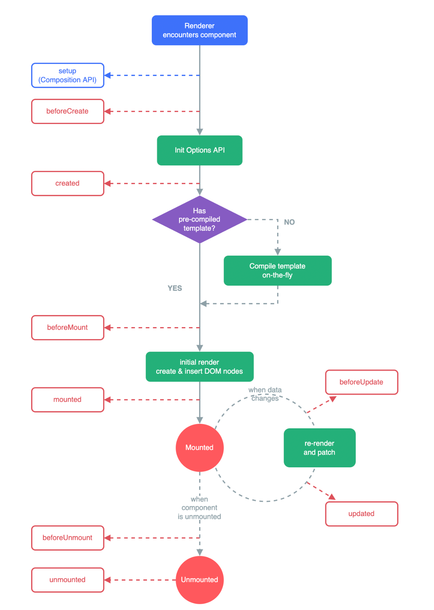

# 生命周期

在Vue中，生命周期指的是Vue实例从创建到销毁的过程。在这个过程中，Vue实例会经历一系列的阶段，包括数据观测、模板编译、挂载DOM、更新DOM、卸载等等。在这些阶段，Vue提供了一些生命周期钩子函数，让我们可以在特定的时机执行某些代码。

## 为什么需要生命周期

生命周期钩子函数为我们提供了在Vue实例生命周期不同阶段执行代码的能力。这对于非响应式的操作非常有用，例如直接操作DOM、添加事件监听器或者创建定时器等。这些操作如果在数据变化时执行可能会导致不必要的性能开销，而生命周期钩子函数让我们可以更合理地安排这些操作的执行时机。一些常用的库，例如`react`，`webpack`都提供了生命周期的钩子，方便开发者理解整个运行流程。

## Vue3 有哪些生命周期，分别在什么时候调用？

Vue3的生命周期钩子函数主要包括：

- `beforeCreate`: 创建实例之前调用，此时实例的数据观测、事件等还未初始化。
- `created`: 创建实例后调用，此时实例的数据观测、事件等已经初始化完成。
- `beforeMount`: 挂载实例之前调用，此时模板已经编译完成，但是还未挂载到DOM。
- `mounted`: 挂载实例后调用，此时实例已经挂载到DOM，可以进行DOM操作。
- `beforeUpdate`: 数据更新之前调用，此时可以进行状态的最后更改。
- `updated`: 数据更新后调用，此时DOM已经完成更新，可以进行DOM操作。
- `beforeUnmount`: 卸载实例之前调用，此时实例仍然完全可用。
- `unmounted`: 卸载实例后调用，此时实例已经完全卸载。

生命周期类型的枚举位于`packages/runtime-core/src/enums.ts`目录下：

```typescript
export const enum LifecycleHooks {
  BEFORE_CREATE = 'bc', // 创建之前
  CREATED = 'c', // 创建
  BEFORE_MOUNT = 'bm', // 挂载之前
  MOUNTED = 'm', // 挂载
  BEFORE_UPDATE = 'bu', // 更新之前
  UPDATED = 'u', // 更新
  BEFORE_UNMOUNT = 'bum', // 卸载之前
  UNMOUNTED = 'um', // 卸载之后
  DEACTIVATED = 'da', // 被 keep-alive 缓存的组件停用时调用。
  ACTIVATED = 'a', // 被 keep-alive 缓存的组件激活时调用。
  RENDER_TRIGGERED = 'rtg', // 依赖被收集时调用
  RENDER_TRACKED = 'rtc', // 依赖被触发时调用
  ERROR_CAPTURED = 'ec', // 错误捕获
  SERVER_PREFETCH = 'sp'
}
```

上面生命周期可以用一张图来表示：



## 选项式和组合式生命周期的区别

在Vue3中，我们可以使用选项式API和组合式API来定义组件。这两种API对应的生命周期钩子函数有一些区别。

- 选项式API的生命周期钩子函数定义在组件选项对象的methods中，例如：

```javascript
export default {
  methods: {
    created() {
      // do something
    }
  }
}
```

- 组合式API的生命周期钩子函数定义在`setup`函数中，需要使用`import`从`vue`中引入，例如：

```javascript
import { onMounted } from 'vue';

export default {
  setup() {
    onMounted(() => {
      // do something
    });
  }
}
```

需要注意的是，在组合式API中没有`beforecate`和`created`钩子，因为他们本身被`setup`这个函数替代了，直接把相关逻辑写在`setup`中就行了

## 父子组件生命周期的执行顺序

父子组件生命周期的执行顺序是在父子组件的执行顺序下通过调度算法按`Vue`的规则进行执行的。首先父组件先实例化进行执行，通过上面的生命周期的调用说明，我们可以知道，先执行父组件的`beforeMount`，然后去获取父组件的虚拟DOM，然后在`patch`的过程中遇到虚拟节点是组件类型的时候，就又会去走组件初始化的流程，这个时候其实就是子组件初始化，那么之后子组件也需要走一遍组件的所有流程，子组件在第一次渲染的时候，先执行子组件的`beforeMount`，再去获取子组件的虚拟DOM，然后`patch`子组件的虚拟DOM，如果过程中又遇到节点是组件类型的话，又去走一遍组件初始化的流程，直到子组件patch完成，然后执行子组件的mounted生命周期函数，接着回到父组件的执行栈，执行父组件的`mounted`生命周期。

所以在初始化创建的时候，是深度递归创建子组件的过程，父子组件的生命周期的执行顺序是：

1. 父组件 -> `beforeMount`
2. 子组件 ->` beforeMount`
3. 子组件 -> `mounted`
4. 父组件 -> `mounted`

**父子组件更新顺序同样是深度递归执行的过程：**

因为如果父子组件存在通过props传递数据的话，就必须先更新父组件，才能更新子组件。因为子组件自己是没办法拿到最新的`props`的，必须通过父组件传递进去。同时如果父组件有一些通过`ref`操作子组件DOM的操作，就需要保证子组件的已经更新完成。

在组件更新的源码中有这么一段，如果有`next`表示是父组件更新引起的更新，这个时候需要调用`updateComponentPreRender`进行子组件数据的更新。所以我们父组件一定要在子组件之前调用`breforeUpdate`。

```javascript
if (next) {
    next.el = vnode.el
    // 在组件更新前，先更新一些数据
    updateComponentPreRender(instance, next, optimized)
} else {
    next = vnode
}
```

例如更新props,更新slots

```javascript
const updateComponentPreRender = (
    instance: ComponentInternalInstance,
    nextVNode: VNode,
    optimized: boolean
  ) => {
    nextVNode.component = instance
    const prevProps = instance.vnode.props
    instance.vnode = nextVNode
    instance.next = null
    // 更新props
    updateProps(instance, nextVNode.props, prevProps, optimized)
    // 更新slots
    updateSlots(instance, nextVNode.children, optimized)
	// ...
  }
```

所以在父子组件更新的时候，父子组件的生命周期执行顺序是：

1. 父组件 ->` beforeUpdate`
2. 子组件 -> `beforeUpdate`
3. 子组件 -> `updated`
4. 父组件 ->` updated`

同样卸载的时候父子组件也是深度递归遍历执行的过程：

1. 父组件 -> `beforeUnmount`
2. 子组件 -> `beforeUnmount`
3. 子组件 -> `unmounted`
4. 父组件 -> `unmounted`

理解父子组件生命周期的调用流程需要我们对`Vue`的渲染过程有清晰的认知。因为`Vue`渲染是一个自定向下逐步递归的过程。

## 使用生命周期的一些注意事项

- 生命周期钩子函数的`this`上下文指向调用它的Vue实例。在箭头函数中不可用，因为箭头函数绑定了父级作用域的上下文。
- `setup`函数是唯一可以使用组合式API生命周期钩子函数的地方，其他地方使用会导致运行时错误。但是不是一定要卸载setup函数中，如果和`setup`函数是同一个执行上下文也是可以的。
- 生命周期钩子函数的执行顺序是：`beforeCreate` -> `created` -> `beforeMount` -> `mounted` -> `beforeUpdate` -> `updated` -> `beforeUnmount` -> `unmounted`。

## 源码-生命周期的注册

```typescript
// 生命周期的创建
export const onBeforeMount = createHook(LifecycleHooks.BEFORE_MOUNT)
export const onMounted = createHook(LifecycleHooks.MOUNTED)
export const onBeforeUpdate = createHook(LifecycleHooks.BEFORE_UPDATE)
export const onUpdated = createHook(LifecycleHooks.UPDATED)
export const onBeforeUnmount = createHook(LifecycleHooks.BEFORE_UNMOUNT)
export const onUnmounted = createHook(LifecycleHooks.UNMOUNTED)
export const onServerPrefetch = createHook(LifecycleHooks.SERVER_PREFETCH)
```

可以看到各个生命周期的`Hooks`函数是通过`createHook`这个函数创建的。我们在`setup`函数中使用的也就是我们通过`createHook`创建之后的函数

```typescript
// packages/runtime-core/src/apiLifecycle.ts
export const createHook = (lifecycle) => (hook, target = currentInstance) => injectHook(lifecycle, hook, target)
```

`createHook`是一个闭包函数，通过闭包缓存当前是属于哪个生命周期的`hooks`。`target`表示该生命周期`hooks`函数被绑定到哪个组件实例上，默认是当前工作的组件实例。后续我们执行生命周期的时候就需要从绑定的实例上获取当前`hooks`的执行函数执行。`createHook`底层又调用了一个`injectHook`的函数，那么下面我们继续来看看这个`injectHook`函数。

```typescript
export function injectHook(
  type: LifecycleHooks, // 我们调用createHook传入的值
  hook: Function & { __weh?: Function }, // hook执行函数
  target: ComponentInternalInstance | null = currentInstance, // 目标实例
  prepend: boolean = false
): Function | undefined {
  if (target) {
    // 把各个生命周期的Hooks函数挂载到组件实例上，并且是一个数组，因为可能你会多次调用同一个组件的同一个生命周期函数
    const hooks = target[type] || (target[type] = [])
    const wrappedHook =
      hook.__weh ||
      (hook.__weh = (...args: unknown[]) => {
        if (target.isUnmounted) { // 组件卸载了就不执行
          return
        }
        pauseTracking() // 生命周期函数的执行不需要收集响应式依赖，我们只需要在render渲染的时候收集就好了。因为我们依赖的触发响应式变化最后是要修改dom的
        setCurrentInstance(target) // 设置当前实例
        const res = callWithAsyncErrorHandling(hook, target, type, args) // 运行当前hooks
        unsetCurrentInstance()
        resetTracking() // 恢复依赖收集
        return res
      })
    if (prepend) {
      hooks.unshift(wrappedHook) // 把生命周期的包装函数绑定到组件实例对应的hooks上
    } else {
      hooks.push(wrappedHook)
    }
    return wrappedHook
  }
}
```

`injectHook`函数其实就是把我们传递给`onMounted`或者其他生命周期钩子的函数进行包裹生成新的`wrappedHook`函数。然后将生成的函数绑定到对应实例对应的`hooks`上面，供后续调用。所以其实我们我们调用的时候都是调用的`wrappedHook`函数。

另外我们注意到钩子函数运行的时候是停止依赖收集了的。这是因为**依赖的收集只需要在调用**`render`**函数的时候完成即可**，**对于模板没有用到的变量不需要进行**`DOM`**更新**。所以在生命周期钩子内部收集依赖是**没有必要**的。

**选项式和组合式生命周期的注册**

在组合式中，我们调用的例如`onMounted`其实就是我们通过`createHook`注册之后返回的函数。所以调用`onMounted`实际上就是调用`createHook`返回的`injectHook`函数。

```vue
// 组合 API
<script>
import { onMounted } from 'vue'

export default {
   setup () {
     onMounted(() => {
       console.log('mounted in the composition api!')
     })
   }
}
</script>
```

在选项式中，我们通过如下方式调用生命周期函数。

```typescript
// 选项 API
<script>     
   export default {         
      mounted() {             
         console.log('mounted!')         
      },         
      updated() {             
         console.log('updated!')         
      }     
   }
</script> 
```

那么我们是何时注册到组件实例上的呢。还记得我们在组件初始化的时候会调用`applyOptions`嘛。生命周期函数的注册也是在这个函数里面完成的。

```typescript
export function applyOptions() { // 省略参数
	// 省略其他代码
	registerLifecycleHook(onBeforeMount, beforeMount) // 注册生命周期钩子函数
  registerLifecycleHook(onMounted, mounted)
  registerLifecycleHook(onBeforeUpdate, beforeUpdate)
  registerLifecycleHook(onUpdated, updated)
  registerLifecycleHook(onActivated, activated)
  registerLifecycleHook(onDeactivated, deactivated)
  registerLifecycleHook(onErrorCaptured, errorCaptured)
  registerLifecycleHook(onRenderTracked, renderTracked)
  registerLifecycleHook(onRenderTriggered, renderTriggered)
  registerLifecycleHook(onBeforeUnmount, beforeUnmount)
  registerLifecycleHook(onUnmounted, unmounted)Ï
  registerLifecycleHook(onServerPrefetch, serverPrefetch)
  // 省略其他代码
}
```

我们会调用`registerLifecycleHook`进行生命周期的注册。第一个参数是注册函数，也就是我们通过`createHook`创建的函数。第二个参数就是用户通过选项式编写的生命周期函数。

```typescript
function registerLifecycleHook(
    register: Function,
    hook?: Function | Function[]
  ) {
    if (isArray(hook)) {
      hook.forEach(_hook => register(_hook.bind(publicThis)))
    } else if (hook) {
      register(hook.bind(publicThis))
    }
  }
```

所以我们可以看到生命周期的注册主要还`injectHook`这个函数的执行。

## 源码-生命周期的调用

生命周期的函数发生在组件创建，挂载，更新和卸载阶段。我们来分别看看这几个阶段中生命周期如何被调用

### 创建

在组件创建的过程中，我们主要执行`beforeCreate`和`created`函数。对于选项式写法来说就是在`applyOptions`中执行。注意：再次强调对于组合式写法来说没有这两个钩子函数，因为`setup`的执行就代替了这两个生命周期函数

```typescript
export function applyOptions() { // 省略参数
	// 省略其他代码
	if (options.beforeCreate) { // 调用beforeCreate
    callHook(options.beforeCreate, instance, LifecycleHooks.BEFORE_CREATE)
  }
  // 省略其他代码
  if (created) { // created操作
    callHook(created, instance, LifecycleHooks.CREATED)
  }
  // 省略其他代码
}
```

可以看到`beforeCreate`在我们初始化最开始调用。`created`在我们完成了基本的初始化例如`watch,computed`处理再进行调用。这个时候在页面上是看不到我们的`dom`的。

生命周期钩子函数是通过调用`callHook`函数实现的。`callHook`函数接收两个参数：Vue实例和生命周期钩子函数的名称。在函数内部，首先从Vue实例的`$options`中获取对应的生命周期钩子函数数组，然后遍历这个数组，依次执行每个生命周期钩子函数。

```javascript
function callHook(
  hook: Function,
  instance: ComponentInternalInstance,
  type: LifecycleHooks
) {
  callWithAsyncErrorHandling(
    isArray(hook)
      ? hook.map(h => h.bind(instance.proxy!)) // 遍历执行当前的hooks
      : hook.bind(instance.proxy!), // 在这里绑定上instance.proxy的实例，这样可以通过this访问到data，props这些属性的值了
    instance,
    type
  )
}
```

### 挂载

组件的挂载发生在第一次`patch`过程中，如果遇到了组件类型就会调用`mountComponent`函数进行组件的挂载。然后会调用`setupRenderEffect`创建副作用函数，最后会去执行`componentUpdateFn`进行组件的挂载，我们挂载的生命周期也是在这个函数中进行调用的。

```typescript
const componentUpdateFn = () => { // 省略参数
  if (!instance.isMounted) { // 初次挂载
    const { bm, m, parent } = instance
    if (bm) { // 触发beforemount钩子函数
      invokeArrayFns(bm) // invokeArrayFns在执行beforeMount的时候包裹一层try catch,因为beforeMount是用户写的代码可能出		现错误,为了保证程序能继续运行下去所以需要一层保护机制。
    }

    //省略其他代码
    const subTree = (instance.subTree = renderComponentRoot(instance)) // 递归调用子组件获取最终的vnode 通过执行模板编译后生成的render函数，再进行相应的处理，得到最终的vnode。

    // 子树patch

    // mounted hook // 触发mounted钩子函数,放在后置队列执行，因为mounted要在组件渲染之后执行
    if (m) {
      queuePostRenderEffect(m, parentSuspense)
    }
  } else {
    // 更新逻辑
  }
}
```

可以看到在渲染刚开始我们就会调用`beforemount`，这个执行是同步的。然后我们会执行子组件的挂载操作。等子组件处理完了我们就会调用`mounted`。从这里我们也能看出父子组件的执行顺序和父子组件生命周期函数的执行顺序了。

> 注意`mounted`的调用是异步的，我们会将`mounted`通过`queuePostRenderEffect`放入调度器的后置队列执行。因为我们在`mounted`的时候可能去访问DOM节点，所以必须保证我们执行`mounted`的时候DOM已经挂载完了。而DOM的挂载是通过`queueJob`放置的普通任务。所以将`mounted`放入后置队列可以保证DOM一定挂载完成

### 更新

组件的更新发生在响应式数据变更后。响应式数据的变更会触发我们注册的副作用函数，最后也会调用到 `componentUpdateFn`走更新逻辑。

```typescript
const componentUpdateFn = () => { // 省略参数
  if (!instance.isMounted) { // 初次挂载
    // 挂载逻辑
  } else {
    // 更新逻辑
    let { next, bu, u, parent, vnode } = instance
     //省略其他代码
    // beforeUpdate hook // 触发beforeUpdate钩子函数
    if (bu) {
      invokeArrayFns(bu)
    }
    const nextTree = renderComponentRoot(instance) // 重新渲染子树，调用一下render函数，生成新的vnode
    // 子树patch
    
    // updated hook // 触发updated钩子函数,放在后置队列执行
    if (u) {
      queuePostRenderEffect(u, parentSuspense)
    }
  }
}
```

更新流程中生命周期函数的调用和挂载类似。也是从父组件的`beforeUpdate`开始，最后到父组件的`updated`结束。

> 同理，这里的`updated`也需要在后置队列中执行

### 卸载

组件卸载发生的时机可以先看我的[组件卸载](/blogs/unmount/index)这篇文章。卸载过程最后会调用`unmountComponent`进行组件的卸载

```typescript
const unmountComponent = (
    instance: ComponentInternalInstance,
    parentSuspense: SuspenseBoundary | null,
    doRemove?: boolean
  ) => {
  	//省略其他代码
    const { bum, scope, update, subTree, um } = instance
    // beforeUnmount hook // 调用 beforeUnmount狗子
    if (bum) {
      invokeArrayFns(bum)
    }
  	// 组件卸载
    // unmounted hook // 调用unmounted钩子
    if (um) {
      queuePostRenderEffect(um, parentSuspense)
    }
  }
```

组件卸载的生命周期的调用也挺直观的就不过多赘述。

> 同理，这里的`unmounted`也需要在后置队列中执行

## 总结

感觉`vue3`中生命周期`hooks`的功能和`react hooks`很类似，`react hooks`的本质就是把状态变量、副作用函数存到函数组件的fiber对象上，等到将来状态变量发生改变的时候，相关的函数组件fiber就重新进行更新。Vue3这边的实现原理也类似，通过上面的生命周期的`hooks`实现原理，我们可以知道`Vue3`的生命周期的`Hooks`是绑定到具体的组件实例上。

总之，Vue3的生命周期钩子函数是一个非常强大的特性，它让我们可以在Vue实例的生命周期中的特定时机执行代码。通过了解生命周期钩子函数的原理，我们可以更好地理解Vue的运行机制，编写更高效、更健壮的代码。在Vue3中，我们可以使用选项式API和组合式API来定义组件，这两种API对应的生命周期钩子函数有一些使用上的区别。在实际开发中，我们需要根据实际需求选择合适的API来定义组件。