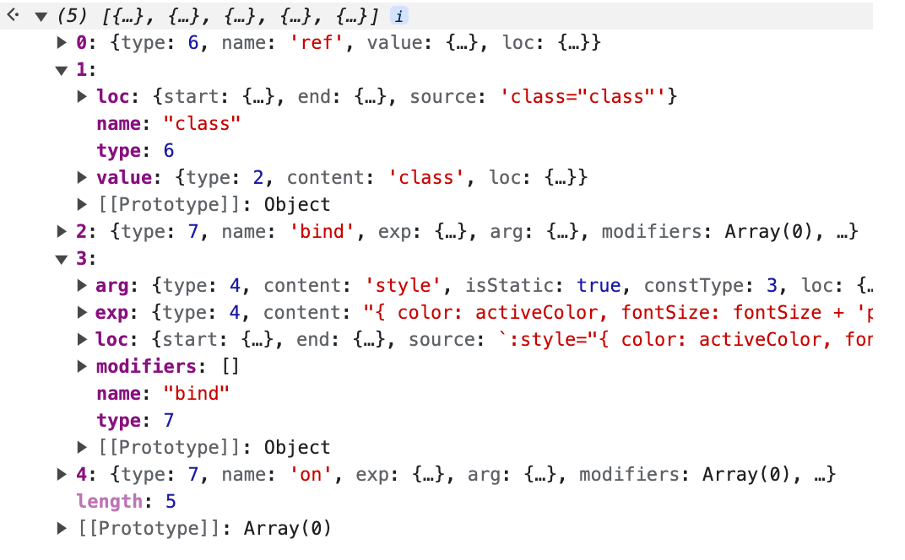

# 属性和指令的解析

`parseTag`在解析时首先匹配标签文本结束的位置，并前进代码到标签文本后面的空白字符后，然后会解析标签中的属性，比如 class、style 和指令等。但是我们知道在 Vue 模板中元素，我们不仅可以写属性还可以写 Vue 的指令。首先我们先大概的了解一下我们属性解析之后究竟是怎么样的。

```html
<div
     ref="ref"
     class="class"
     :class="{ active: isActive }"
     :style="{ color: activeColor, fontSize: fontSize + 'px' }"
     @click="clickItem(item)"
>
  test
</div>
```



最后所有的属性都会被解析到一个数组中，最后会挂在节点的 `props`属性上。每一个 `prop`就包含了一个属性的所有信息。

我们知道一个完整的属性包含三部分：`属性名称`、`=`、`属性值`。在 Vue 模板中可能是属性名称如：class 、id 这样的属性，也可能是 Vue 的指令如：on-xx、:xxx ，所以解析时会将 Vue 指令也进行单独处理。

在上面的例子中也能发现，对于 Vue 指令和属性，返回的节点类型也是不一样的。

- `type = 6`: 属性
- `type = 7`: 指令

**并且在属性节点描述上也存在很大不一样。**

- `属性`：包含了一个 `value`描述对象`type 为 2（文本）`

- `指令`：包含了 `exp`描述对象用于记录指令的表达式信息`type 为4（表达式）`。如果指令存在参数，还会`arg`描述对象用于记录指令中的参数`type 为4（表达式）`。

接下来我们从源码层面看下是如何实现的：

## parseAttributes

```typescript
function parseAttributes(
  context: ParserContext,
  type: TagType
): (AttributeNode | DirectiveNode)[] {
  const props = []
  const attributeNames = new Set<string>() // 用一个set存储所有属性，防止有重复的属性
  while (
    context.source.length > 0 &&
    !startsWith(context.source, '>') &&
    !startsWith(context.source, '/>')
  ) {
    if (startsWith(context.source, '/')) {
      emitError(context, ErrorCodes.UNEXPECTED_SOLIDUS_IN_TAG)
      advanceBy(context, 1)
      advanceSpaces(context)
      continue
    }
    if (type === TagType.End) { // 结束标签不能有属性
      emitError(context, ErrorCodes.END_TAG_WITH_ATTRIBUTES)
    }

    const attr = parseAttribute(context, attributeNames) // 解析属性

    // Trim whitespace between class
    // https://github.com/vuejs/core/issues/4251
    if (
      attr.type === NodeTypes.ATTRIBUTE &&
      attr.value &&
      attr.name === 'class'
    ) {
      attr.value.content = attr.value.content.replace(/\s+/g, ' ').trim() // class要去掉空格
    }

    if (type === TagType.Start) { // 开始标签才处理属性嘞
      props.push(attr)
    }

    if (/^[^\t\r\n\f />]/.test(context.source)) {
      emitError(context, ErrorCodes.MISSING_WHITESPACE_BETWEEN_ATTRIBUTES)
    }
    advanceSpaces(context)
  }
  return props
}
```

可以看到`parseAttributes`主要是同一个一个`while`循环，不断的调用`parseAttribute`进行属性的解析，最后将所有的属性都放在`props`中。

## parseAttribute

```typescript
function parseAttribute(
  context: ParserContext,
  nameSet: Set<string> // 也就是我们传进来的attributeNames
): AttributeNode | DirectiveNode {
  __TEST__ && assert(/^[^\t\r\n\f />]/.test(context.source))

  // Name.
  const start = getCursor(context) // 获取开始位置
  const match = /^[^\t\r\n\f />][^\t\r\n\f />=]*/.exec(context.source)! // 正则匹配到属性名
  const name = match[0] // 找到属性名字

  if (nameSet.has(name)) { // 重复属性警告
    emitError(context, ErrorCodes.DUPLICATE_ATTRIBUTE)
  }
  nameSet.add(name) // 添加属性名

  if (name[0] === '=') { // 属性名前面不能有=
    emitError(context, ErrorCodes.UNEXPECTED_EQUALS_SIGN_BEFORE_ATTRIBUTE_NAME)
  }
  {
    const pattern = /["'<]/g // 当节点属性的名称中包含 「"」、「'」、「<」 时会警告和报错。
    let m: RegExpExecArray | null
    while ((m = pattern.exec(name))) {
      emitError(
        context,
        ErrorCodes.UNEXPECTED_CHARACTER_IN_ATTRIBUTE_NAME,
        m.index
      )
    }
  }

  advanceBy(context, name.length) // 移动

  // Value
  let value: AttributeValue = undefined

  if (/^[\t\r\n\f ]*=/.test(context.source)) { // 以零个或多个空白字符（包括制表符、回车符、换行符和换页符）开头，后面紧跟着一个等号。
    advanceSpaces(context)
    advanceBy(context, 1)
    advanceSpaces(context)
    value = parseAttributeValue(context) // 获取属性值内容。{ content, isQuoted, loc: getSelection(context, start) }
    if (!value) {
      emitError(context, ErrorCodes.MISSING_ATTRIBUTE_VALUE)
    }
  }
  const loc = getSelection(context, start) // 获取位置信息

  if (!context.inVPre && /^(v-[A-Za-z0-9-]|:|\.|@|#)/.test(name)) { // 正则含义：以"v-"开始的任意字母、数字、横杠组合、冒号、点、@符号或#号中的任意一个字符开头。以"v-"开始的任意字母、数字、横杠组合、冒号、点、@符号或#号中的任意一个字符开头
    const match =
      /(?:^v-([a-z0-9-]+))?(?:(?::|^\.|^@|^#)(\[[^\]]+\]|[^\.]+))?(.+)?$/i.exec(
        name
      )!

    let isPropShorthand = startsWith(name, '.') // props是不是缩写
    let dirName = // 获取指令的名字 . :是bind @是on #是slot
      match[1] ||
      (isPropShorthand || startsWith(name, ':')
        ? 'bind'
        : startsWith(name, '@')
        ? 'on'
        : 'slot')
    let arg: ExpressionNode | undefined

    if (match[2]) {
      const isSlot = dirName === 'slot' // 是都是插槽
      const startOffset = name.lastIndexOf( // 开始位置
        match[2],
        name.length - (match[3]?.length || 0)
      )
      const loc = getSelection( // 获取位置信息
        context,
        getNewPosition(context, start, startOffset),
        getNewPosition(
          context,
          start,
          startOffset + match[2].length + ((isSlot && match[3]) || '').length
        )
      )
      let content = match[2] // 属性节点内容
      let isStatic = true // 判断是不是静态节点

      if (content.startsWith('[')) { // []这种肯定不是动态的啦
        isStatic = false

        if (!content.endsWith(']')) {
          emitError(
            context,
            ErrorCodes.X_MISSING_DYNAMIC_DIRECTIVE_ARGUMENT_END
          )
          content = content.slice(1)
        } else {
          content = content.slice(1, content.length - 1)
        }
      } else if (isSlot) {
        // #1241 special case for v-slot: vuetify relies extensively on slot
        // names containing dots. v-slot doesn't have any modifiers and Vue 2.x
        // supports such usage so we are keeping it consistent with 2.x.
        content += match[3] || '' // slot特殊处理
      }

      arg = { // 参数信息
        type: NodeTypes.SIMPLE_EXPRESSION, // 指令类型
        content,
        isStatic, // 是不是静态的
        constType: isStatic
          ? ConstantTypes.CAN_STRINGIFY
          : ConstantTypes.NOT_CONSTANT,
        loc
      }
    }

    if (value && value.isQuoted) { // 更改位置信息
      const valueLoc = value.loc
      valueLoc.start.offset++
      valueLoc.start.column++
      valueLoc.end = advancePositionWithClone(valueLoc.start, value.content)
      valueLoc.source = valueLoc.source.slice(1, -1)
    }

    const modifiers = match[3] ? match[3].slice(1).split('.') : []
    if (isPropShorthand) modifiers.push('prop')

    // 2.x compat v-bind:foo.sync -> v-model:foo // 语法糖解析
    if (__COMPAT__ && dirName === 'bind' && arg) {
      if (
        modifiers.includes('sync') &&
        checkCompatEnabled(
          CompilerDeprecationTypes.COMPILER_V_BIND_SYNC,
          context,
          loc,
          arg.loc.source
        )
      ) {
        dirName = 'model'
        modifiers.splice(modifiers.indexOf('sync'), 1)
      }

      if (__DEV__ && modifiers.includes('prop')) {
        checkCompatEnabled(
          CompilerDeprecationTypes.COMPILER_V_BIND_PROP,
          context,
          loc
        )
      }
    }

    return {
      type: NodeTypes.DIRECTIVE, // 指令类型
      name: dirName,
      exp: value && { // 指令的表达式信息
        type: NodeTypes.SIMPLE_EXPRESSION, // 指令表达式信息
        content: value.content,
        isStatic: false,
        // Treat as non-constant by default. This can be potentially set to
        // other values by `transformExpression` to make it eligible for hoisting.
        constType: ConstantTypes.NOT_CONSTANT,
        loc: value.loc
      },
      arg, // 指令参数的表达式信息
      modifiers,
      loc
    }
  }

  // missing directive name or illegal directive name
  if (!context.inVPre && startsWith(name, 'v-')) {
    emitError(context, ErrorCodes.X_MISSING_DIRECTIVE_NAME)
  }

  return { // 不是指令类型就返回属性的描述对象
    type: NodeTypes.ATTRIBUTE, // 属性类型
    name,
    value: value && {
      type: NodeTypes.TEXT, // 文本内容
      content: value.content,
      loc: value.loc
    },
    loc
  }
}
```

`parseAttribute`代码逻辑虽然很长，但是可以看到主要是做几件事

1. 获取属性名`name`
2. 调用`parseAttributeValue(context)`获取属性值`value`
3. 通过`!context.inVPre && /^(v-[A-Za-z0-9-]|:|\.|@|#)/.test(name)`判断当前是属性还是指令。这个`if`里面的是指令。如果不是指令的话就返回属性的描述对象
4. 如果是指令，我们需要通过指令的类型获取指令的名称`dirName`最后会赋值给`name`。然后获取指令的表达式信息`exp`和参数表达是信息`arg`
5. 最后返回我们的指令参数的描述对象

## parseAttributeValue

```typescript
function parseAttributeValue(context: ParserContext): AttributeValue {
  const start = getCursor(context)
  let content: string

  const quote = context.source[0]
  const isQuoted = quote === `"` || quote === `'` // 找到引号类型
  if (isQuoted) {
    // Quoted value.
    advanceBy(context, 1)

    const endIndex = context.source.indexOf(quote) // 找到结束的引号位置
    if (endIndex === -1) { 
      content = parseTextData(
        context,
        context.source.length,
        TextModes.ATTRIBUTE_VALUE
      )
    } else {
      content = parseTextData(context, endIndex, TextModes.ATTRIBUTE_VALUE) // 解析文本内容
      advanceBy(context, 1)
    }
  } else {
    // Unquoted
    const match = /^[^\t\r\n\f >]+/.exec(context.source)
    if (!match) {
      return undefined
    }
    const unexpectedChars = /["'<=`]/g
    let m: RegExpExecArray | null
    while ((m = unexpectedChars.exec(match[0]))) {
      emitError(
        context,
        ErrorCodes.UNEXPECTED_CHARACTER_IN_UNQUOTED_ATTRIBUTE_VALUE,
        m.index
      )
    }
    content = parseTextData(context, match[0].length, TextModes.ATTRIBUTE_VALUE)
  }

  return { content, isQuoted, loc: getSelection(context, start) }
}
```

`parseAttributeValue`的解析方法比较简单：

- - 如果 `value值``有引号(「"」or 「'」)`开始，那么就找到下一个引号为 value 值结束
  - 如果`value值``没有引号`，那么就找到下一个空格为 value 值结束