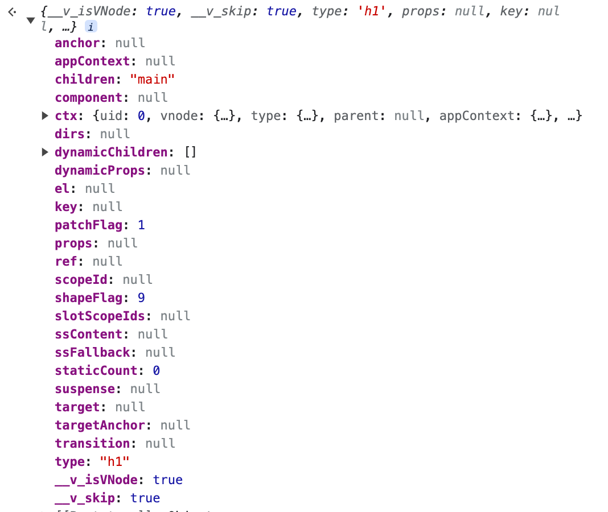

# 初次渲染概览

在最开始读源码的时候，我们需要对源码的整个运行流程有个大概的了解，以便我们知道源码的各个结果是如何组织起来的，这样不至于看到相关概念的时候是一头雾水。

```vue
<script src="../../dist/vue.global.js"></script>

<div id="demo">
  <h1>{{ currentBranch }}</h1>
</div>

<script>
const { createApp, ref } = Vue

createApp({
  setup() {
    const currentBranch = ref('main')
    return {
      currentBranch,
    }
  }
}).mount('#demo')
</script>
```

我们会以上面这个例子去带着大家了解初识挂载的运行流程。主要的函数都是从`packages/runtime-dom/src/index.ts`中导出

## createApp

我们程序的入口就是`createApp`函数(`packages/runtime-dom/src/index.ts`)。下面先看下函数实现。

```typescript
export const createApp = ((...args) => {
  const app = ensureRenderer().createApp(...args) // 1. 创建渲染器  2. 创建app -- app也就是整个应用，里面有非常多的东东

  const { mount } = app
  app.mount = (containerOrSelector: Element | ShadowRoot | string): any => { // createApp返回的app.mount方法是一个标准的可跨平台的组件渲染流程，它不包含任何特定平台的相关逻辑，简单理解就是这里面的逻辑都是跟平台无关的。就以container来说，在web平台最终是一个DOM节点，但是在小程序或其他平台就是其他的了。因此需要重写。
    const container = normalizeContainer(containerOrSelector) // 1. 标准化container
    if (!container) return

    const component = app._component // 根组件,就是createApp里面传入的一个对象
    if (!isFunction(component) && !component.render && !component.template) { // 函数组件/render/template
      component.template = container.innerHTML // 2. 设置组件模版
      // 2.x compat check // 兼容2.0
      if (__COMPAT__ && __DEV__) {
        for (let i = 0; i < container.attributes.length; i++) {
          const attr = container.attributes[i]
          if (attr.name !== 'v-cloak' && /^(v-|:|@)/.test(attr.name)) {
            compatUtils.warnDeprecation(
              DeprecationTypes.GLOBAL_MOUNT_CONTAINER,
              null
            )
            break
          }
        }
      }
    }
 
    container.innerHTML = '' // 3. 清空容器内容
    const proxy = mount(container, false, container instanceof SVGElement) // 4. 调用原始的mount
    if (container instanceof Element) {
      container.removeAttribute('v-cloak')
      container.setAttribute('data-v-app', '')
    }
    return proxy
  }
  return app // 返回app
})
```

`createApp`函数主要做了以下几件事情

1. 调用`ensureRenderer`创建`render`渲染器。我们页面渲染的主要逻辑都在这里面
2. 调用`createApp`创建应用`app`
3. 重写`mount`逻辑，因为`vue`设计的是跨平台的，所以我们需要针对`web`环境重写`mount`。重写逻辑中主要是标准化挂载容器和获取我们渲染的模版内容。最后调用原始的`mount`进行挂载
4. 返回`app`

## baseCreateRenderer

上面提到，我们会调用`ensureRenderer`创建渲染器，下面我们看下这个函数实现

```js
function ensureRenderer() {
  return (
    renderer ||
    (renderer = createRenderer<Node, Element | ShadowRoot>(rendererOptions)) // 懒加载实现，如果没有到render就方便做tree-shaking
  )
}
```

`ensureRenderer`会调用到`createRenderer`，`createRenderer`最终会调用到`baseCreateRenderer`。我们主要到`createRenderer`中会传入`rendererOptions`（`packages/runtime-dom/src/nodeOps.ts`），这里就是和原生`dom`操作相关的方法啦，在`baseCreateRenderer`里的渲染函数中会用到。

```js
function baseCreateRenderer(
  options: RendererOptions,
  createHydrationFns?: typeof createHydrationFunctions
): any {
  const patch: PatchFn = ( // 大概就是根据vnode的type和shapeType来判断调用哪种方法来处理这个节点
    n1, // 旧vnode
    n2, // 新vnode
    container,
    anchor = null,
    parentComponent = null,
    parentSuspense = null,
    isSVG = false,
    slotScopeIds = null,
    optimized = __DEV__ && isHmrUpdating ? false : !!n2.dynamicChildren
  ) => {
    // 处理渲染逻辑
  }
  /*不同类型节点的处理函数等*/
  const render: RootRenderFunction = (vnode, container, isSVG) => { // vnode是根vnode。container在web平台就是dom节点
    if (vnode == null) { // 没有vnode就执行卸载逻辑
      if (container._vnode) {
        unmount(container._vnode, null, null, true)
      }
    } else {
      patch(container._vnode || null, vnode, container, null, null, null, isSVG) // 有就执行patch逻辑
    }
    flushPreFlushCbs() // 前置队列执行
    flushPostFlushCbs() // 后置队列执行
    container._vnode = vnode // dom节点上添加根vnode。这个也就是旧的节点，后续可以用来和新节点做对比
  }
  // 不同类型组件的处理函数
  return {
    render,
    hydrate,
    createApp: createAppAPI(render, hydrate) // 创建app的方法。这里会调用render方法
  }
}
```

`baseCreateRenderer`函数非常长，里面包括了所有不同节点的处理函数，我们先不关注，主要先关注这个函数的返回值。其中`createApp`是我们后面需要关注的，这个属性值为`createAppAPI`的返回值，在`createAppAPI`中我们传入了`render`函数，这样我们在`createApp`内部使用`render`函数了。

## createAppAPI

```js
export function createAppAPI<HostElement>(
  render: RootRenderFunction<HostElement>, // 这里的render是baseCreateRenderer里面传进来的，是一个函数闭包
  hydrate?: RootHydrateFunction
): CreateAppFunction<HostElement> {
  return function createApp(rootComponent, rootProps = null) { // rootComponent其实就是要渲染的根组件
    if (!isFunction(rootComponent)) {
      rootComponent = extend({}, rootComponent)
    }

    const context = createAppContext() // 创建应用上下文,这里是整个应用的上下文

    const installedPlugins = new WeakSet() // 插件相关

    let isMounted = false // 是否已经挂载

    const app: App = (context.app = { // 创建应用app对象
      _uid: uid++,
      _component: rootComponent as ConcreteComponent, // 这里挂载跟组件
      _props: rootProps,
      _container: null,
      _context: context,
      _instance: null,

      version,

      get config() {
        return context.config
      },

      use(plugin: Plugin, ...options: any[]) { // 使用插件
      },

      mixin(mixin: ComponentOptions) { // 全局的mixin挂载在应用上下文上面
      },

      component(name: string, component?: Component): any { // 全局的组件
      },

      directive(name: string, directive?: Directive) { // 全局的指令
      },

      mount( // 挂载
        rootContainer: HostElement, // web平台就是DOM节点
        isHydrate?: boolean, // 是否服务器渲染，暂不关注
        isSVG?: boolean
      ): any {
      },

      unmount() { // 卸载
      },

      provide(key, value) { // 全局的provide
      },
    })

    return app
  }
}
```

`createAppAPI`函数中主要是调用`createAppContext`生成全局上下问，并返回了`app`对象。

```js
export function createAppContext(): AppContext {
  return {
    app: null as any,
    config: {
      isNativeTag: NO,
      performance: false,
      globalProperties: {},
      optionMergeStrategies: {},
      errorHandler: undefined,
      warnHandler: undefined,
      compilerOptions: {}
    },
    mixins: [],
    components: {},
    directives: {},
    provides: Object.create(null),
    optionsCache: new WeakMap(),
    propsCache: new WeakMap(),
    emitsCache: new WeakMap()
  }
}
```

全局上下文`context`中主要存储了一些全局的数据，例如全局`mixins`，全局组件`components`等等。我们返回的`app`对象上也挂载了一些我们常见的方法，主要是用来更改全局上下文状态的。例如我们常用的`app.mixin`就是向`context`的`mixins push`内容。

## mount

调用了`createApp`后，我们最终会返回一个`app`对象。然后我们会调用`app.mount`去挂载组件。刚刚`mount`重写的逻辑我们已经看过了，我们看`mount`的原始实现

```js
mount( // 挂载
  rootContainer: HostElement, // web平台就是DOM节点
  isHydrate?: boolean, // 是否服务器渲染，暂不关注
  isSVG?: boolean
): any {
  if (!isMounted) { // 防止重复调用,重复调用mount只有第一次生效
    const vnode = createVNode(rootComponent, rootProps) // 1. 调用createVNode创建根组件的vnode，createVNode其实就是h。
    vnode.appContext = context // 2. 缓存应用的上下文对象到根vnode，并且在组件初始化挂载的时候会将其被添加到根实例上

    if (isHydrate && hydrate) { // 服务端渲染，不关注。所有含有hydrate字样的都是服务端渲染
      hydrate(vnode as VNode<Node, Element>, rootContainer as any)
    } else {
      render(vnode, rootContainer, isSVG) // 3. 渲染根组件，调用baseCreateRenderer中的render方法
    }
    isMounted = true // 已经挂载了。
    app._container = rootContainer

    return getExposeProxy(vnode.component!) || vnode.component!.proxy
  } else if (__DEV__) {
  }
},
```

可以看到`mount`主要做两件事情

1. 调用`createVNode`创建应用根组件，`createVNode`也就是我们说的`h`函数
2. 调用`render`函数从根组件开始渲染

## createVNode

`createVNode`最终会调用到`_createVNode`函数

```js
function _createVNode(
  type: VNodeTypes | ClassComponent | typeof NULL_DYNAMIC_COMPONENT, // type也就是我们传进来的内容，组件/vnode，在初次挂载的时候也就是我们传进来的根对象
  props: (Data & VNodeProps) | null = null,
  children: unknown = null,
  patchFlag: number = 0,
  dynamicProps: string[] | null = null,
  isBlockNode = false
): VNode {
  if (!type || type === NULL_DYNAMIC_COMPONENT) {
    type = Comment
  }

  if (isVNode(type)) { // type是Vnode的处理
    // createVNode receiving an existing vnode. This happens in cases like
    // <component :is="vnode"/>
    // #2078 make sure to merge refs during the clone instead of overwriting it
    const cloned = cloneVNode(type, props, true /* mergeRef: true */)
    if (children) {
      normalizeChildren(cloned, children)
    }
    if (isBlockTreeEnabled > 0 && !isBlockNode && currentBlock) { // 编译优化，处理动态组件
      if (cloned.shapeFlag & ShapeFlags.COMPONENT) {
        currentBlock[currentBlock.indexOf(type)] = cloned
      } else {
        currentBlock.push(cloned)
      }
    }
    cloned.patchFlag |= PatchFlags.BAIL
    return cloned
  }

  // // 标准化用class写的组件
  if (isClassComponent(type)) { 
    type = type.__vccOpts
  }

  // 标准化异步组件和函数式组件
  if (__COMPAT__) { 
    type = convertLegacyComponent(type, currentRenderingInstance)
  }

  // 标准化class props style
  if (props) { 
    // for reactive or proxy objects, we need to clone it to enable mutation.
    props = guardReactiveProps(props)!
    let { class: klass, style } = props
    if (klass && !isString(klass)) {
      props.class = normalizeClass(klass)
    }
    if (isObject(style)) {
      // reactive state objects need to be cloned since they are likely to be
      // mutated
      if (isProxy(style) && !isArray(style)) {
        style = extend({}, style)
      }
      props.style = normalizeStyle(style)
    }
  }

  const shapeFlag = isString(type) // 判断当前组件的类型
    ? ShapeFlags.ELEMENT
    : __FEATURE_SUSPENSE__ && isSuspense(type)
    ? ShapeFlags.SUSPENSE
    : isTeleport(type)
    ? ShapeFlags.TELEPORT
    : isObject(type)
    ? ShapeFlags.STATEFUL_COMPONENT // 有状态组件
    : isFunction(type)
    ? ShapeFlags.FUNCTIONAL_COMPONENT // 函数组件
    : 0


  return createBaseVNode(
    type,
    props,
    children,
    patchFlag, // 更新类型
    dynamicProps,
    shapeFlag,
    isBlockNode,
    true
  )
}
```

`_createVNode`函数就是对我们传进来的内容不断的做标准化，然后根据传进来的`type`计算除不同的节点类型`shapeFlag`，最后调用`createBaseVNode`并返回。

`shapeFlag`在`vue`中用来表示节点类型，我们后面会根据不同的节点类型做不同的处理。枚举如下：

```tsx
export const enum ShapeFlags {
  ELEMENT = 1, // 表示一个普通的HTML元素
  FUNCTIONAL_COMPONENT = 1 << 1, // 函数式组件
  STATEFUL_COMPONENT = 1 << 2,  // 有状态组件
  TEXT_CHILDREN = 1 << 3, // 子节点是文本
  ARRAY_CHILDREN = 1 << 4, // 子节点是数组
  SLOTS_CHILDREN = 1 << 5, // 子节点是插槽
  TELEPORT = 1 << 6, // 表示vnode描述的是个teleport组件
  SUSPENSE = 1 << 7, // 表示vnode描述的是个suspense组件
  COMPONENT_SHOULD_KEEP_ALIVE = 1 << 8, // 表示需要被keep-live的有状态组件
  COMPONENT_KEPT_ALIVE = 1 << 9, // 已经被keep-live的有状态组件
  COMPONENT = ShapeFlags.STATEFUL_COMPONENT | ShapeFlags.FUNCTIONAL_COMPONENT // 组件，有状态组件和函数式组件的统称
}
```

## createBaseVNode

```js
function createBaseVNode(
  type: VNodeTypes | ClassComponent | typeof NULL_DYNAMIC_COMPONENT,
  props: (Data & VNodeProps) | null = null,
  children: unknown = null,
  patchFlag = 0,
  dynamicProps: string[] | null = null, // 动态属性
  shapeFlag = type === Fragment ? 0 : ShapeFlags.ELEMENT,
  isBlockNode = false,
  needFullChildrenNormalization = false
) {
  const vnode = { // 创建一个vnode
    __v_isVNode: true,
    __v_skip: true,
    type, // type就是组件内容
    props, // props
    key: props && normalizeKey(props), // 标准化key
    ref: props && normalizeRef(props), // 标准化 props
    scopeId: currentScopeId,
    slotScopeIds: null,
    children, // 孩子节点
    component: null,
    suspense: null,
    ssContent: null,
    ssFallback: null,
    dirs: null,
    transition: null,
    el: null, // 真实dom节点
    anchor: null,
    target: null,
    targetAnchor: null,
    staticCount: 0,
    shapeFlag, // 组件类型
    patchFlag, // 更新类型
    dynamicProps,
    dynamicChildren: null, // 动态节点
    appContext: null,
    ctx: currentRenderingInstance
  } as VNode

  if (needFullChildrenNormalization) {
    normalizeChildren(vnode, children) // 标准化子组件
    // normalize suspense children
    if (__FEATURE_SUSPENSE__ && shapeFlag & ShapeFlags.SUSPENSE) {
      ;(type as typeof SuspenseImpl).normalize(vnode) // 标准化异步组件
    }
  } else if (children) {
    vnode.shapeFlag |= isString(children) // 给ShapeFlags添加children类型
      ? ShapeFlags.TEXT_CHILDREN
      : ShapeFlags.ARRAY_CHILDREN
  }


  // 处理动态节点，用来优化更新
  if (
    isBlockTreeEnabled > 0 &&
    !isBlockNode &&
    currentBlock &&
    (vnode.patchFlag > 0 || shapeFlag & ShapeFlags.COMPONENT) &&
    vnode.patchFlag !== PatchFlags.HYDRATE_EVENTS
  ) {
    currentBlock.push(vnode) // 放入到父亲的区块中去
  }

  if (__COMPAT__) {
    convertLegacyVModelProps(vnode)
    defineLegacyVNodeProperties(vnode)
  }

  return vnode
}
```

这个函数返回的是一个对象(vnode)。也就是我们常说的虚拟`dom`。上面会有非常多的属性，主要属性都已经做注释。有关`patchFlag`和`block`我们后面在讲，这个和我们的性能优化相关。

有了`vnode`之后我们所有的操作都是直接操作`vnode`而不是直接操作`dom`。只需要在最后挂载的时候调用一下原生的`dom`方法将`vnode`渲染在页面上。使用`vnode`有以下好处

1. 跨平台的，我们不同的平台只需要调用自己的渲染方法渲染我们的`vnode`对象就好了。
2. 组件的渲染逻辑和真实的`dom`完全解藕，我们都是在操作`vnode`，只有最后需要关注不同平台的挂载。
3. 由于我们事直接操作`vnode`对象，这样大大提高了我们的性能。毕竟`dom`大量的`dom`操作还是很耗性能的。

## render

回到我们的`mount`函数，我们已经通过`createVNode`创建好了一个虚拟`dom`节点。我们现在需要通过`render`函数讲`vnode`做一些列处理并渲染到页面上

```js
const render: RootRenderFunction = (vnode, container, isSVG) => { // vnode是根vnode。container在web平台就是dom节点
  if (vnode == null) { // 没有vnode就执行卸载逻辑
    if (container._vnode) {
      unmount(container._vnode, null, null, true)
    }
  } else {
    patch(container._vnode || null, vnode, container, null, null, null, isSVG) // 有就执行patch逻辑
  }
  flushPreFlushCbs() // 前置队列执行
  flushPostFlushCbs() // 后置队列执行
  container._vnode = vnode // dom节点上添加根vnode。这个也就是旧的节点，后续可以用来和新节点做对比
}
```

`render`函数的实现还是比较简单的，我们判断传入的`vnode`是否存在就执行卸载或者`patch`逻辑。

## patch

```js
const patch: PatchFn = ( // 大体是根据vnode的type和shapeType来判断调用哪种方法来处理这个节点
    n1, // 旧vnode
    n2, // 新vnode
    container, // 需要挂载到哪个dom节点
    anchor = null,
    parentComponent = null,
    parentSuspense = null,
    isSVG = false,
    slotScopeIds = null,
    optimized = __DEV__ && isHmrUpdating ? false : !!n2.dynamicChildren
  ) => {
    // 如果新旧vnode节点相同，则无须patch
    if (n1 === n2) {
      return
    }

   	// 如果新旧vnode节点type类型不同，则直接卸载旧节点
    if (n1 && !isSameVNodeType(n1, n2)) { 
      anchor = getNextHostNode(n1)
      unmount(n1, parentComponent, parentSuspense, true)
      n1 = null
    }

    if (n2.patchFlag === PatchFlags.BAIL) { // PatchFlags.BAIL 标志用于指示应该退出 diff 优化
      optimized = false
      n2.dynamicChildren = null
    }

    const { type, ref, shapeFlag } = n2 // 这里的type就是我们的组件
    // 根据新节点的类型，采用不同的函数进行处理 -- 根据type和shapeFlag来走不同的分支逻辑
    switch (type) {
      // 处理文本
      case Text:
        processText(n1, n2, container, anchor)
        break
      // 处理注释
      case Comment:
        processCommentNode(n1, n2, container, anchor)
        break
      // 处理静态节点
      case Static:
        if (n1 == null) {
          mountStaticNode(n2, container, anchor, isSVG)
        } else if (__DEV__) {
          patchStaticNode(n1, n2, container, isSVG)
        }
        break
      // 处理Fragment，根组件都会用一个block包起来
      case Fragment:
        processFragment(
          n1,
          n2,
          container,
          anchor,
          parentComponent,
          parentSuspense,
          isSVG,
          slotScopeIds,
          optimized
        )
        break
      default:
        // element类型
        if (shapeFlag & ShapeFlags.ELEMENT) { // 根据shapeFlag来走不同的逻辑，shapeFlag在createVnode的时候添加，根据type不同生成不同的值
          processElement( // 处理元素节点
            n1,
            n2,
            container,
            anchor,
            parentComponent,
            parentSuspense,
            isSVG,
            slotScopeIds,
            optimized
          )
        } else if (shapeFlag & ShapeFlags.COMPONENT) { // 组件 -- 有状态组件和函数组件都走到这个逻辑
          processComponent(
            n1,
            n2,
            container,
            anchor,
            parentComponent,
            parentSuspense,
            isSVG,
            slotScopeIds,
            optimized
          )
        } else if (shapeFlag & ShapeFlags.TELEPORT) { // 处理TELEPORT组件
          ;(type as typeof TeleportImpl).process(
            n1 as TeleportVNode,
            n2 as TeleportVNode,
            container,
            anchor,
            parentComponent,
            parentSuspense,
            isSVG,
            slotScopeIds,
            optimized,
            internals
          )
        } else if (__FEATURE_SUSPENSE__ && shapeFlag & ShapeFlags.SUSPENSE) { // 处理SUSPENSE组件
          ;(type as typeof SuspenseImpl).process(
            n1,
            n2,
            container,
            anchor,
            parentComponent,
            parentSuspense,
            isSVG,
            slotScopeIds,
            optimized,
            internals
          )
        } else if (__DEV__) {
          warn('Invalid VNode type:', type, `(${typeof type})`)
        }
    }

    if (ref != null && parentComponent) { // 处理ref，会将挂载逻辑放在post队列里面去处理。
      setRef(ref, n1 && n1.ref, parentSuspense, n2 || n1, !n2)
    }
  }
```

`patch`这个函数还是非常重要的，后续我们所有节点的挂载和更新都会走到这个函数去做判断。`patch` 方法第一个参数`n1`为旧的`vnode`, `n2`为新的`vnode`，其他的参数暂时不关注。这个函数的主要逻辑就是根据我们`vnode`的`type`和`shapFlag`来决定我们这个`vnode`要执行哪类节点的处理函数。在我们这个例子中，我们传入的是一个对象，属于有状态节点，最后会走到`processComponent`这个函数中去。

## processComponent

```js
const processComponent = ( // 处理函数组件和有状态组件
    n1: VNode | null,
    n2: VNode,
    container: RendererElement,
    anchor: RendererNode | null,
    parentComponent: ComponentInternalInstance | null,
    parentSuspense: SuspenseBoundary | null,
    isSVG: boolean,
    slotScopeIds: string[] | null,
    optimized: boolean
  ) => {
    n2.slotScopeIds = slotScopeIds
    if (n1 == null) { // 旧的vnode是空的时候说明是初次挂载，就调用mountComponent，否则调用更新updateComponent
      if (n2.shapeFlag & ShapeFlags.COMPONENT_KEPT_ALIVE) { // keep-alive
        ;(parentComponent!.ctx as KeepAliveContext).activate(
          n2, // mount的时候只用传入新的vnode就好
          container,
          anchor,
          isSVG,
          optimized
        )
      } else {
        mountComponent(
          n2, // mount的时候只用传入新的vnode就好
          container,
          anchor,
          parentComponent,
          parentSuspense,
          isSVG,
          optimized
        )
      }
    } else {
      updateComponent(n1, n2, optimized) // 更新节点
    }
  }
```

`processComponent`这个函数的实现也是非常简单的，通过判断旧节点`n1`是否存在来走挂载还是更新流程。显然，我们初次挂载是没有旧节点的，走挂载逻辑，调用`mountComponent`。

## mountComponent

```js
const mountComponent: MountComponentFn = ( // 初次挂载
    initialVNode, // mount的时候只用传入新的vnode就好
    container,
    anchor,
    parentComponent,
    parentSuspense,
    isSVG,
    optimized
  ) => {
    // mounting
    const compatMountInstance =
      __COMPAT__ && initialVNode.isCompatRoot && initialVNode.component
    const instance: ComponentInternalInstance =
      compatMountInstance ||
      (initialVNode.component = createComponentInstance( // 1. createComponentInstance创建组件实例
        initialVNode,
        parentComponent,
        parentSuspense
      ))


    // 处理keep-alive组件
    if (isKeepAlive(initialVNode)) {
      ;(instance.ctx as KeepAliveContext).renderer = internals
    }

    // resolve props and slots for setup context
    if (!(__COMPAT__ && compatMountInstance)) {
      setupComponent(instance) // 2. 对组件实例进行处理，例如props，attrs，setup选项式等等
    }

    if (__FEATURE_SUSPENSE__ && instance.asyncDep) {
      parentSuspense && parentSuspense.registerDep(instance, setupRenderEffect)

      if (!initialVNode.el) {
        const placeholder = (instance.subTree = createVNode(Comment))
        processCommentNode(null, placeholder, container!, anchor)
      }
      return
    }

    /**
     * 声明组件更新的函数（响应式的状态变更后要执行的函数）。
     * 创建响应式副作用对象。
     * 在组件的作用范围内收集这个响应式副作用对象作为依赖。
     * 设置响应式副作用渲染函数。
     * 调用这个响应式副作用对象中的run方法。
     */
    setupRenderEffect( // 3. setupRenderEffect设置渲染的副作用方法。
      instance,
      initialVNode,
      container,
      anchor,
      parentSuspense,
      isSVG,
      optimized
    )
  }
```

`mountComponent`中主要干了以下几件事情：

1. 调用`createComponentInstance`创建组件实例。
2. 调用`setupComponent`设置组件的`props`、`slots`等，然后处理组件的状态`setup`并对`vue2`的选项式做兼容。
3. 调用`setupRenderEffect`设置渲染的副作用方法。

这几个方法我们后面会详细讲，由于我们现在是初步了解，可以先不特别关注。

我们先看下`setupRenderEffect`，因为我们组件的渲染逻辑在这里面。

## setupRenderEffect

```js
const setupRenderEffect: SetupRenderEffectFn = (
  instance,
  initialVNode,
  container,
  anchor,
  parentSuspense,
  isSVG,
  optimized
) => {
  // 1. 声明组件更新的函数（响应式的状态变更后要执行的函数）。
  const componentUpdateFn = () => { // 组件的更新函数,在这里面处理的时候会调用track函数
  }

  // 2. 创建响应式副作用对象。
  const effect = (instance.effect = new ReactiveEffect(
    componentUpdateFn,
    () => queueJob(update),
    instance.scope // 3. 在组件的作用范围内收集这个响应式副作用对象作为依赖。
  )) // 4. 设置响应式副作用渲染函数。

  // 5. 调用这个响应式副作用对象中的run方法。
  const update: SchedulerJob = (instance.update = () => effect.run())
  update.id = instance.uid // 这个id在flush job的时候排序用到的
  // allowRecurse
  toggleRecurse(instance, true)

  update() // 调用update触发更新
}
```

`setupRenderEffect`主要干了以下几件事：

1. 判断`instance.isMounted`是挂载还是更新阶段，我们初次挂载肯定是挂载阶段。
2.  声明组件更新的函数`componentUpdateFn`，这个函数是后面响应式的状态变更后要执行的函数。
3. 调用`ReactiveEffect`创建响应式副作用对象。这个我们可以重点关注下这里，后续我们讲解响应式原理的时候能想起来这里就行。
4. 设置响应式副作用函数为`componentUpdateFn`。并设置调度器为`() => queueJob(update)`。这个`queueJob`和调度相关，我们后面再讲。
5. 调用`update`函数触发响应式副作用的`run`函数

我们现在不需要关注`ReactiveEffect`做了什么，只需要知道触发了`effect`实例的`run`函数我们最终会触发`componentUpdateFn`函数，并且会在当前副作用的作用域下收集依赖。

## componentUpdateFn

```js
const componentUpdateFn = () => { // 组件的更新函数,在这里面处理的时候会调用track函数
  if (!instance.isMounted) { // 初次挂载
    let vnodeHook: VNodeHook | null | undefined
    const { el, props } = initialVNode
    const { bm, m, parent } = instance
    const isAsyncWrapperVNode = isAsyncWrapper(initialVNode)

    toggleRecurse(instance, false) // 不允许递归
    // beforeMount hook
    if (bm) { // 触发beforemount钩子函数
      invokeArrayFns(bm)
    }
    // onVnodeBeforeMount
    if (
      !isAsyncWrapperVNode &&
      (vnodeHook = props && props.onVnodeBeforeMount)
    ) {
      invokeVNodeHook(vnodeHook, parent, initialVNode)
    }
    if (
      __COMPAT__ &&
      isCompatEnabled(DeprecationTypes.INSTANCE_EVENT_HOOKS, instance)
    ) {
      instance.emit('hook:beforeMount')
    }
    toggleRecurse(instance, true)

    if (el && hydrateNode) {
      // 服务器渲染
    } else {
      const subTree = (instance.subTree = renderComponentRoot(instance)) //  递归调用子组件 通过执行模板编译后生成的render函数，再进行相应的处理，得到最终的vnode。
      patch( // 调用patch挂载孩子
        null,
        subTree,
        container,
        anchor,
        instance,
        parentSuspense,
        isSVG
      ) // 挂载子树vnode到容器中
      initialVNode.el = subTree.el // 将真实dom放在vnode的el属性上
    }
    // mounted hook调用
    if (m) {
      queuePostRenderEffect(m, parentSuspense)
    }
    // onVnodeMounted
    if (
      !isAsyncWrapperVNode &&
      (vnodeHook = props && props.onVnodeMounted)
    ) {
      const scopedInitialVNode = initialVNode
      queuePostRenderEffect(
        () => invokeVNodeHook(vnodeHook!, parent, scopedInitialVNode),
        parentSuspense
      )
    }
    if (
      __COMPAT__ &&
      isCompatEnabled(DeprecationTypes.INSTANCE_EVENT_HOOKS, instance)
    ) {
      queuePostRenderEffect(
        () => instance.emit('hook:mounted'),
        parentSuspense
      )
    }

    instance.isMounted = true

    if (__DEV__ || __FEATURE_PROD_DEVTOOLS__) {
      devtoolsComponentAdded(instance)
    }

    // #2458: deference mount-only object parameters to prevent memleaks
    initialVNode = container = anchor = null as any
  } else {
    // updateComponent 更新组件
  }
}
```

`componentUpdateFn`主要做了以下事情

1. 判断当前是挂载还是更新，我们肯定是挂载阶段。
2. 调用`beforeMount`钩子函数
3. 调用`renderComponentRoot`获取当前示例的子组件。
4. 基于`subTree`再次调用`patch`，基于`renderComponentRoot`返回的`vnode`，再次进行渲染。这个组件的孩子可以是各种类型的，所以我们需要再次`patch`去执行子孩子的挂载逻辑。这是一个深度遍历的过程，也是符合我们逻辑的，毕竟父组件很多操作要等子组件实例完了才行
5. 更新`instance.isMounted`，渲染完毕。

我们现在不需要关注`renderComponentRoot`具体做了什么，只需要知道他也会返回`vnode`对象，然后放在`instance.subTree`中。在我们这个例子中返回的`vnode`如下。



`shapFlag`为9，所以在`patch`中我们会走到`processElement`

## processElement

```js
const processElement = ( // 处理元素类型的节点
    n1: VNode | null, // 旧节点
    n2: VNode, // 新节点
    container: RendererElement,
    anchor: RendererNode | null,
    parentComponent: ComponentInternalInstance | null,
    parentSuspense: SuspenseBoundary | null,
    isSVG: boolean,
    slotScopeIds: string[] | null,
    optimized: boolean
  ) => {
    isSVG = isSVG || n2.type === 'svg'
    if (n1 == null) { // 挂载阶段
      mountElement(
        n2,
        container,
        anchor,
        parentComponent,
        parentSuspense,
        isSVG,
        slotScopeIds,
        optimized
      )
    } else {
      patchElement( // 更新阶段
        n1,
        n2,
        parentComponent,
        parentSuspense,
        isSVG,
        slotScopeIds,
        optimized
      )
    }
  }
```

`processElement`逻辑也很节点，主要是处理元素节点的渲染，判断是否存在旧节点决定进入挂载还是更新阶段。在我们初次渲染的时候是`mountElement`阶段。

## mountElement

```js
/**
    根据vnode创建出真实DOM结构，并保存在el属性上。
    根据子节点类型来进行不同的操作：
    文本类型，直接生成文本节点
    数组类型，则递归的处理子节点
    对vnode的指令以及props内容进行处理。
    最后将生成的DOM挂载到容器container上，也就最终呈现在页面上了。
   */
  const mountElement = (
    vnode: VNode,
    container: RendererElement,
    anchor: RendererNode | null,
    parentComponent: ComponentInternalInstance | null,
    parentSuspense: SuspenseBoundary | null,
    isSVG: boolean,
    slotScopeIds: string[] | null,
    optimized: boolean
  ) => {
    let el: RendererElement // dom真实节点
    let vnodeHook: VNodeHook | undefined | null
    const { type, props, shapeFlag, transition, dirs } = vnode

    el = vnode.el = hostCreateElement( // 调用原生的dom操作createElement创建节点并赋值给vnode.el，表示我已经初始化好了
      vnode.type as string,
      isSVG,
      props && props.is,
      props
    )

    // 通过shapeFlag判断孩子是文本还是数组，在我们这里是文本节点
    if (shapeFlag & ShapeFlags.TEXT_CHILDREN) {
      hostSetElementText(el, vnode.children as string) // 设置文本节点内容，在我们这里就是currentBranch对应的值main
    } else if (shapeFlag & ShapeFlags.ARRAY_CHILDREN) {
      mountChildren( // 是孩子节点就遍历每一个孩子调用patch函数
        vnode.children as VNodeArrayChildren,
        el,
        null,
        parentComponent,
        parentSuspense,
        isSVG && type !== 'foreignObject',
        slotScopeIds,
        optimized
      )
    }

    if (dirs) {
      invokeDirectiveHook(vnode, null, parentComponent, 'created')
    }
    // scopeId
    setScopeId(el, vnode, vnode.scopeId, slotScopeIds, parentComponent)
    // props
    if (props) { 
      // 处理props
    }

    if (dirs) {
      invokeDirectiveHook(vnode, null, parentComponent, 'beforeMount')
    }
    const needCallTransitionHooks = needTransition(parentSuspense, transition)
    if (needCallTransitionHooks) {
      transition!.beforeEnter(el)
    }
    hostInsert(el, container, anchor) // 通过调用原生dom操作insertBefore挂载我们刚刚创建的dom，这样就可以渲染在页面上了
    if (
      (vnodeHook = props && props.onVnodeMounted) ||
      needCallTransitionHooks ||
      dirs
    ) {
      queuePostRenderEffect(() => {
        vnodeHook && invokeVNodeHook(vnodeHook, parentComponent, vnode)
        needCallTransitionHooks && transition!.enter(el)
        dirs && invokeDirectiveHook(vnode, null, parentComponent, 'mounted')
      }, parentSuspense)
    }
  }
```

`mountElement`的逻辑大致如下：

1. 根据`vnode`的`type`创建真实的`DOM`节点——`el`
2. 处理`vnode`的`children`，`children`有两种情况：

- 直接就是一个文本，只需要把文本设置到`el`即可
- 是一个`vnode`数组，此时需要调用`mountChildren`去处理`children`，并且此时`container`变成了`el`。`mountChildren`就是循环遍历我们的`children`然后对每一个`children`都调用`patch`执行下

1. 调用`hostPatchProp`设置`props`
2. 待该`vnode`的所有子节点处理完成，再通过调用`hostInsert`，将`el`挂载到`container`中。

到这里我们就完成我们我们上述例子的初次渲染了，一些细节内容我们有意忽略，后面在详细讲解。

## 总结

从初次渲染我们可以看出，`vue`从`vnode`到创建真实`dom`挂载的过程其实是一个深度优先遍历的过程，从我们的根组件出发，如果存在子节点就遍历子节点。不断重复上述过程我们就完成了初次渲染。那我们会思考，更新过程是不是也需要从根节点出发遍历一遍呢。在`react`我们确实每次需要遍历整棵虚拟`dom`树，但是在`vue`中我们不需要，我们可以实现组件级别的更新，还记得我们的创建副作用函数传递的`componentUpdateFn`函数吧，我们每一个组件都会创建一个副作用，因为我们只需要调用对应组件的`componentUpdateFn`函数就可以了。同时，`vue`在编译过程中的静态提升和靶向更新(`patchFlag`)也帮助我们更高效的更新`dom`。这些我们后续都会讲到。