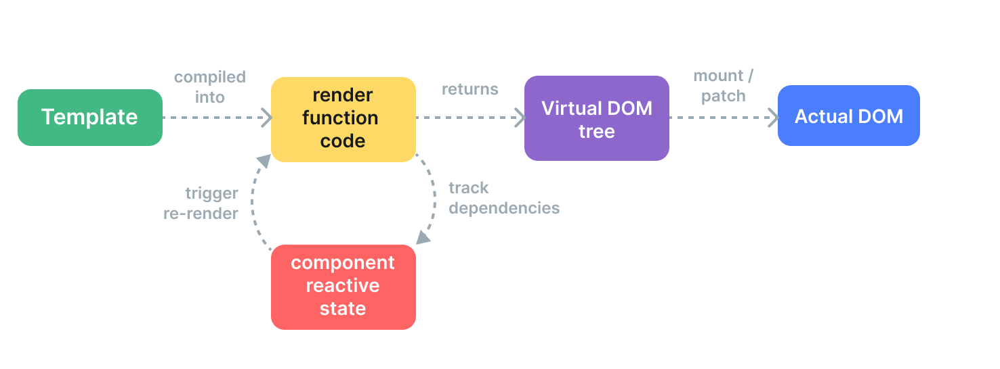

# 虚拟dom

Vue 是如何将一份模板转换为真实的 DOM 节点的，又是如何高效地更新这些节点的呢？这些都离不开虚拟`dom`这个概念，接下来我们就先了解下虚拟`dom`这个概念以及它是什么。

## 什么是虚拟dom

在使用前端框架的时候，我们经常会听到虚拟`dom`这个概念。那么到底什么是虚拟`dom`呢？

虚拟 DOM (Virtual DOM，简称 VDOM) 是一种编程概念，意为将目标所需的 UI 通过数据结构“虚拟”地表示出来，保存在内存中，然后将真实的 DOM 与之保持同步。这个概念是由 [React](https://reactjs.org/) 率先开拓，随后被许多不同的框架采用，当然也包括 Vue。简单来说，**虚拟 DOM 就是一个用 JavaScript 对象表示真实 DOM 的概念**。

在`vue3`中，虚拟`dom`，也就是代码里面的`vnode`，他就是一个对象，定义位于 `packages/runtime-core/src/vnode.ts` 文件中。`VNode` 类的结构如下，具体字段是怎么使用的我们后续章节一个个讲解。

```javascript
export interface VNode<
  HostNode = RendererNode,
  HostElement = RendererElement,
  ExtraProps = { [key: string]: any }
> {
  __v_isVNode: true
  [ReactiveFlags.SKIP]: true
  type: VNodeTypes
  props: (VNodeProps & ExtraProps) | null
  key: string | number | symbol | null
  ref: VNodeNormalizedRef | null
  scopeId: string | null
  slotScopeIds: string[] | null
  children: VNodeNormalizedChildren
  component: ComponentInternalInstance | null
  dirs: DirectiveBinding[] | null
  transition: TransitionHooks<HostElement> | null
  // DOM
  el: HostNode | null
  anchor: HostNode | null // fragment anchor
  target: HostElement | null // teleport target
  targetAnchor: HostNode | null // teleport target anchor
  staticCount: number
  suspense: SuspenseBoundary | null
  ssContent: VNode | null
  ssFallback: VNode | null
  shapeFlag: number
  patchFlag: number
  dynamicProps: string[] | null
  dynamicChildren: VNode[] | null
  appContext: AppContext | null
  ctx: ComponentInternalInstance | null
  memo?: any[]
  isCompatRoot?: true
  ce?: (instance: ComponentInternalInstance) => void
}
```

与其说虚拟 DOM 是一种具体的技术，不如说是一种模式，所以并没有一个标准的实现。我们可以用一个简单的例子来说明：

```js
const vnode = {
  type: 'div',
  props: {
    id: 'hello'
  },
  children: [
    /* 更多 vnode */
  ]
}
```

这里所说的 `vnode` 即一个纯 JavaScript 的对象 (一个“虚拟节点”)，它代表着一个 `<div>` 元素。它包含我们创建实际元素所需的所有信息。它还包含更多的子节点，这使它成为虚拟 DOM 树的根节点。

一个运行时渲染器将会遍历整个虚拟 DOM 树，并据此构建真实的 DOM 树。这个过程被称为**挂载** (mount)。

如果我们有两份虚拟 DOM 树，渲染器将会有比较地遍历它们，找出它们之间的区别，并应用这其中的变化到真实的 DOM 上。这个过程被称为**更新** (patch)，又被称为“比对”(diffing) 或“协调”(reconciliation)。

虚拟 DOM 带来的主要收益是它让开发者能够灵活、声明式地创建、检查和组合所需 UI 的结构，同时只需把具体的 DOM 操作留给渲染器去处理。

## 为什么使用虚拟dom

在前端开发中，频繁地操作 DOM 是非常耗时的，因为每次操作都会引发浏览器的重排和重绘。为了解决这个问题，虚拟 DOM 应运而生。通过在内存中模拟 DOM，我们可以批量地计算出 DOM 的变化，从而减少对真实 DOM 的操作次数。这样可以提高应用的性能，特别是在大型应用中。

例如当一次操作中有100次更新DOM的动作时，虚拟DOM不会立即操作DOM，而是和原本的DOM进行对比，将这100次更新的变化部分内容保存到内存中，最终一次性地应用在DOM树上，再进行后续操作，避免大量无谓的计算量。

虚拟DOM实际上就是采用JavaScript对象来存储DOM节点的信息，将DOM的更新变成对象的修改，并且这些修改计算在内存中发生，当修改完成后，再将JavaScript转换成真实的DOM节点，交给浏览器，从而达到性能的提升。

## 虚拟dom的好处

使用虚拟 DOM 的好处主要有以下几点：

1. **性能优化**：通过减少直接操作真实 DOM 的次数，可以降低浏览器的重绘和回流成本，从而提高页面性能。
2. **跨平台**：虚拟 DOM 不依赖于浏览器环境，可以方便地在不同平台（如服务器端渲染、移动端应用等）使用。
3. **易于测试**：因为虚拟 DOM 是 JavaScript 对象，我们可以直接对其进行操作和断言，而不需要依赖浏览器环境。

同时`vue3`的设计也是这样的，我们可以看到源码的组织结构将各个目录拆开来，`runtime-core`的实现就是与平台无关的。在浏览器环境下使用`runtime-dom`的`dom`操作，在其他平台使用各个平台的`dom`操作，实现了跨平台。

## vue中vnode是如何运行的

从高层面的视角看，Vue 组件挂载时会发生如下几件事：

1. **编译**：Vue 模板被编译为**渲染函数**：即用来返回虚拟 DOM 树的函数。这一步骤可以通过构建步骤提前完成，也可以通过使用运行时编译器即时完成。
2. **挂载**：运行时渲染器调用渲染函数，遍历返回的虚拟 DOM 树，并基于它创建实际的 DOM 节点。这一步会作为响应式副作用执行，因此它会追踪其中所用到的所有响应式依赖。
3. **更新**：当一个依赖发生变化后，副作用会重新运行，这时候会创建一个更新后的虚拟 DOM 树。运行时渲染器遍历这棵新树，将它与旧树进行比较，然后将必要的更新应用到真实 DOM 上去。



可以看到我们一切操作都是针对于虚拟DOM的，只有在最后提交的时候才会将虚拟DOM挂载到浏览器上面

## 怎么创建虚拟dom

在`vue3`中，我们在`template`模版中编写的代码最终都会通过`compiler`模块进行编译，编译之后会返回一个`render`字符串，后面在应用运行的时候会调用这个`render`生成`render`函数。在函数里面会调用不同的方法进行虚拟`dom`的创建。

例如下面的模版:

> 可以去https://template-explorer.vuejs.org/  网站体验模版编译结果

```vue
<template>
  <hello-world :msg="msg" :info="info"></hello-world>
  <div>
    <button @click="addAge">Add age</button>
    <button @click="toggleMsg">Toggle Msg</button>
  </div>
</template>
```

经过编译之后会生成如下函数：

```js
import { resolveComponent as _resolveComponent, createVNode as _createVNode, createElementVNode as _createElementVNode, Fragment as _Fragment, openBlock as _openBlock, createElementBlock as _createElementBlock } from "vue"

const _hoisted_1 = ["onClick"]
const _hoisted_2 = ["onClick"]

export function render(_ctx, _cache, $props, $setup, $data, $options) {
  const _component_hello_world = _resolveComponent("hello-world")

  return (_openBlock(), _createElementBlock(_Fragment, null, [
    _createVNode(_component_hello_world, {
      msg: _ctx.msg,
      info: _ctx.info
    }, null, 8 /* PROPS */, ["msg", "info"]),
    _createElementVNode("div", null, [
      _createElementVNode("button", { onClick: _ctx.addAge }, "Add age", 8 /* PROPS */, _hoisted_1),
      _createElementVNode("button", { onClick: _ctx.toggleMsg }, "Toggle Msg", 8 /* PROPS */, _hoisted_2)
    ])
  ], 64 /* STABLE_FRAGMENT */))
}
```

现在我们不用理解这个代码的所有内容，我们只用关注里面创建节点的代码，例如`createVNode`，`createElementVNode`这些就是用来创建虚拟`dom`的。调用完之后会生成虚拟`dom`树。由于树结构过大， 我们这里不做展示，整个结构和我们上面定义的虚拟`dom`结构一致。

接下来我们可以看下创建虚拟`dom`的具体实现，我们只挑常用的创建虚拟`dom`的方法。所有和虚拟`dom`有关的内容都位于源码`packages/runtime-core/src/vnode.ts`中

## createVNode

```typescript
function _createVNode(
  type: VNodeTypes | ClassComponent | typeof NULL_DYNAMIC_COMPONENT, // 如果是组件，type就是组件内容。如果是普通类型就是一个字符串，比方说div, HelloWorld之类的
  props: (Data & VNodeProps) | null = null,
  children: unknown = null, //子组件
  patchFlag: number = 0,
  dynamicProps: string[] | null = null,
  isBlockNode = false
): VNode {
  if (!type || type === NULL_DYNAMIC_COMPONENT) {
    type = Comment
  }

  if (isVNode(type)) { // 是Vnode的处理，例如用户通过h函数编写的代码
    const cloned = cloneVNode(type, props, true /* mergeRef: true */)
    if (children) {
      normalizeChildren(cloned, children) // 标准化孩子
    }
    if (isBlockTreeEnabled > 0 && !isBlockNode && currentBlock) {
      if (cloned.shapeFlag & ShapeFlags.COMPONENT) {
        currentBlock[currentBlock.indexOf(type)] = cloned
      } else {
        currentBlock.push(cloned)
      }
    }
    cloned.patchFlag |= PatchFlags.BAIL
    return cloned
  }

  // 标准化用class写的组件
  if (isClassComponent(type)) { 
    type = type.__vccOpts
  }

  // 标准化异步组件和函数式组件
  if (__COMPAT__) { 
    type = convertLegacyComponent(type, currentRenderingInstance)
  }

  // 标准化class props style
  //对于代理过的对象,我们需要克隆来使用他们
  //因为直接修改会导致触发响应式
  if (props) {
    props = guardReactiveProps(props)! // 防止props是响应式的
    let { class: klass, style } = props
    if (klass && !isString(klass)) {
      props.class = normalizeClass(klass) // 标准话class
    }
    if (isObject(style)) { // 标准化style
      if (isProxy(style) && !isArray(style)) {
        style = extend({}, style)
      }
      props.style = normalizeStyle(style)
    }
  }

  // encode the vnode type information into a bitmap
  const shapeFlag = isString(type) // 根据type不同生成不同的shapeFlag，方便后面对不同的类型做处理
    ? ShapeFlags.ELEMENT
    : __FEATURE_SUSPENSE__ && isSuspense(type)
    ? ShapeFlags.SUSPENSE
    : isTeleport(type)
    ? ShapeFlags.TELEPORT
    : isObject(type)
    ? ShapeFlags.STATEFUL_COMPONENT // 有状态组件
    : isFunction(type)
    ? ShapeFlags.FUNCTIONAL_COMPONENT // 函数组件
    : 0

  return createBaseVNode(
    type,
    props,
    children,
    patchFlag, // 更新类型
    dynamicProps,
    shapeFlag,
    isBlockNode,
    true
  )
}
```

`createVNode`主要是对传递的`type`做出判断,通过赋值`shapeFlag`来标明当前的虚拟节点的类型。

如果`props`含有`style`或者`class`要进行标准化。

例如`<div :style="['background:red',{color:'red'}]"></div>`其中第一个是`cssText`形式、第二个是对象形式，他们应该被转化为对象类型所以转化后应该为`<div style={color:'red',background:'red'}></div>`。当然对于`class`也需要标准化`:class={hello:true,world:false} => :class="hello"`。但是这里处理的其实是用户自己写了`render`函数,而对于使用了`Vue`自带的编译系统之后,是不需要做这一层处理的。

最后会调用`createBaseVNode`进行虚拟`dom`的创建

```typescript
function createBaseVNode(
  type: VNodeTypes | ClassComponent | typeof NULL_DYNAMIC_COMPONENT,
  props: (Data & VNodeProps) | null = null,
  children: unknown = null,
  patchFlag = 0,
  dynamicProps: string[] | null = null, // 动态属性
  shapeFlag = type === Fragment ? 0 : ShapeFlags.ELEMENT,
  isBlockNode = false,
  needFullChildrenNormalization = false
) {
  const vnode = { // 创建一个vnode
    __v_isVNode: true, // 是不是vnode
    __v_skip: true,
    type, // type对于组件来说就是组件内容
    props,
    key: props && normalizeKey(props), // 标准化key
    ref: props && normalizeRef(props), // 标准化 props
    scopeId: currentScopeId,
    slotScopeIds: null,
    children, // 孩子的vnode
    component: null, // 如果是一个组件的话就会有组件的实例，组件实例的subtree上面挂载了这个组件下面所有的vnode
    suspense: null,
    ssContent: null,
    ssFallback: null,
    dirs: null, // 指令相关
    transition: null, // transition相关
    el: null, // 真实dom
    anchor: null, // 插入的位置
    target: null,
    targetAnchor: null,
    staticCount: 0,
    shapeFlag, // 组件类型
    patchFlag, // 靶向更新标记
    dynamicProps, // 动态props
    dynamicChildren: null, // 动态孩子
    appContext: null, // 应用根context
    ctx: currentRenderingInstance
  } as VNode

  if (needFullChildrenNormalization) {
    normalizeChildren(vnode, children) // 标准化子组件。例如插槽啥的。添加children并且更改vnode的shapFlag
    if (__FEATURE_SUSPENSE__ && shapeFlag & ShapeFlags.SUSPENSE) {
      ;(type as typeof SuspenseImpl).normalize(vnode) // 标准化异步组件
    }
  } else if (children) {
    vnode.shapeFlag |= isString(children) // 判断ShapeFlags，可以是多个类型的组合
      ? ShapeFlags.TEXT_CHILDREN
      : ShapeFlags.ARRAY_CHILDREN
  }

 	// 编译优化相关。现在不必了解
  if (
    isBlockTreeEnabled > 0 &&
    // avoid a block node from tracking itself
    !isBlockNode &&
    // has current parent block
    currentBlock &&
    // presence of a patch flag indicates this node needs patching on updates. // 补丁标志的存在表明此节点需要在更新时进行补丁。
    // component nodes also should always be patched, because even if the // 组件节点应该是中有patchFlag
    // component doesn't need to update, it needs to persist the instance on to // 组件不需要更新，它需要将实例持久化到
    // the next vnode so that it can be properly unmounted later. 下一个vnode，以便以后可以正确地卸载它。
    (vnode.patchFlag > 0 || shapeFlag & ShapeFlags.COMPONENT) && // 有patchFlag说明是动态节点
    vnode.patchFlag !== PatchFlags.HYDRATE_EVENTS
  ) {
    currentBlock.push(vnode) // 放入到父亲的区块中去，说明现在的是一个动态节点
  }

  if (__COMPAT__) {
    convertLegacyVModelProps(vnode)
    defineLegacyVNodeProperties(vnode)
  }

  return vnode
}
```

可以看到我们创建了一个`VNode`类型的对象，也就是一个虚拟`dom`。同时对`key、ref、chidren(needFullChildrenNormalization为true)`进行`标准化`。

至此我们就知道`vue3`中虚拟`dom`究竟是怎么产生的啦。

## createElementVNode

> 用于创建普通`tag`的虚拟节点如`<div></div>`

```js
export { createBaseVNode as createElementVNode }
```

可以看到`createElementVNode`其实就是`createBaseVNode`，用来创建虚拟`dom`。

## 项目中使用

上面我们提到，Vue 模板会被预编译成虚拟 DOM 渲染函数。Vue 也提供了 API`(h函数)` 使我们可以不使用模板编译，直接手写渲染函数。在处理高度动态的逻辑时，渲染函数相比于模板更加灵活，因为你可以完全地使用 JavaScript 来构造你想要的 vnode。

但是官方推荐的是使用模版而不是渲染函数。那么为什么 Vue 默认推荐使用模板呢？有以下几点原因：

1. 模板更贴近实际的 HTML。这使得我们能够更方便地重用一些已有的 HTML 代码片段，能够带来更好的可访问性体验、能更方便地使用 CSS 应用样式，并且更容易使设计师理解和修改。
2. 由于其确定的语法，更容易对模板做静态分析。这使得 Vue 的模板编译器能够应用许多编译时优化来提升虚拟 DOM 的性能表现(例如静态提升，靶向更新等等)

在绝大多数情况下，Vue 推荐使用模板语法来创建应用。然而在某些使用场景下，我们真的需要用到 JavaScript 完全的编程能力。这时**渲染函数**就派上用场了。Vue 提供了一个 h() 函数用于创建 vnodes。下面我们来看看`h`函数的用法：

```js
import { h } from 'vue'

const vnode = h(
  'div', // type
  { id: 'foo', class: 'bar' }, // props
  [
    /* children */
  ]
)
```

`h()` 是 **hyperscript** 的简称——意思是“能生成 HTML (超文本标记语言) 的 JavaScript”。这个名字来源于许多虚拟 DOM 实现默认形成的约定。一个更准确的名称应该是 `createVnode()`，但当你需要多次使用渲染函数时，一个简短的名字会更省力。

我们可以在组件中使用`h`函数来执行渲染而使用模版

```js
import { h } from 'vue'

export default {
  setup() { // 需要确保返回的是一个函数而不是一个值，这个函数最后会被用作渲染函数render，这个render在后面会被重复调用的
    // 使用数组返回多个根节点
    return () => [
      h('div'),
      h('div'),
      h('div')
    ]
  }
}
```

以上代码等价于

```vue
<template>
	<div></div>
  <div></div>
  <div></div>
</template>

export default {
  setup() {}
}
```

然后我们可以看下`h`函数的源码：

```typescript
export function h(type: any, propsOrChildren?: any, children?: any): VNode {
  const l = arguments.length
  if (l === 2) { // 只有两个参数,要么是只有孩子，要么是只有props
    if (isObject(propsOrChildren) && !isArray(propsOrChildren)) {
      if (isVNode(propsOrChildren)) { // 如果第二个参数是一个vnode说明是子节点
        return createVNode(type, null, [propsOrChildren])
      }
      return createVNode(type, propsOrChildren) // 没有孩子节点的情况
    } else {
      // 如果propsOrChildren是数组那么一定是孩子节点
      return createVNode(type, null, propsOrChildren)
    }
  } else { // prop和孩子节点都有的情况
    if (l > 3) { // 第三个参数之后都是孩子
      children = Array.prototype.slice.call(arguments, 2)
    } else if (l === 3 && isVNode(children)) {
      children = [children]
    }
    return createVNode(type, propsOrChildren, children)
  }
}
```

可以看到`h`函数有三个参数，第一个参数是类型，第二个是`props`参数或者孩子节点（如果有第三个参数就是`props`，没有第三个参数就要判断下），三个参数是孩子节点。除了类型必填以外，其他的参数都是可选的。`h`函数只是对参数做了一下判断，然后底层还是调用的`createVNode`进行虚拟DOM的创建。

具体判断逻辑代码中都已经注释，大家可以结合着看。

## 总结

现在相信大家已经了解了虚拟`dom`这个东东，后续我们所有的操作都是通过操作虚拟`dom`来实现的，最后挂载的时候通过原生的`dom`操作来将虚拟`dom`挂载到页面上。