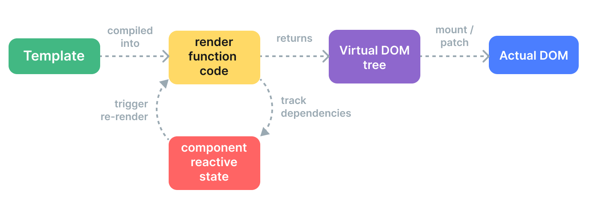

# 源码目录结构
在正式看源码之前，我们可以先来了解一下整个 Vue3 源码的架构，以及用到了哪些工具

## 目录结构

::: tip
我们可以在需要查看目录结构的目录下执行`tree -aI ".git*|.vscode" -C -L 1`就能看到这个目录的整体结构。
:::

```js
├── .circleci // CI 配置目录
├── .ls-lint.yml // 文件命名规范
├── .prettierrc // 代码格式化 prettier 的配置文件
├── CHANGELOG.md  // 更新日志
├── LICENSE
├── README.md
├── api-extractor.json // TypeScript 的API提取和分析工具
├── jest.config.js  //  测试框架 jest 的配置文件
├── node_modules
├── package-lock.json
├── package.json
├── packages // Vue源代码目录
├── rollup.config.js  // 模块打包器 rollup 的配置文件
├── scripts // 一些命令脚本
├── test-dts // TypeScript 声明文件
├── tsconfig.json // TypeScript 配置文件
└── yarn.lock
```

以上是`vue`的根目录结构，`Vue3`采用了`monorepo`的方式来对项目代码进行管理。我们需要关注的源码都位于`packages`目录下

```js
├── compiler-core // 模版编译的核心部分，将我们的模版编译成render函数
├── compiler-dom // dom中的实现
├── compiler-sfc // (.vue)单文件组件编译实现
├── compiler-ssr // 服务端渲染相关
├── dts-built-test
├── dts-test
├── global.d.ts
├── reactivity // 响应式核心
├── reactivity-transform
├── runtime-core // 运行时核心文件。可以是跨平台的
├── runtime-dom // web运行环境的实现
├── runtime-test
├── server-renderer // 服务端渲染相关
├── sfc-playground // vue3在线网页
├── shared // 共享变量
├── template-explorer
├── vue // vue主入口
└── vue-compat
```

上述是`packages`的主要目录，每一部分的职责都非常的明显，我们主要关心的如下几个模块

- compiler-core
- compiler-dom
- runtime-core
- runtime-dom
- reactivity
- vue

## vue运行原理

首先我们先大概了解下`vue`的运行原理，从而更好的知道上述几个模块的作用和他们是如何配合的。我们忽略一些细枝末节的地方，`vue`的挂载可以拆解为如下几个部分：

1. 将编写好的 **template模板**，转换为**AST**（compile parse）
2. 将 **AST** 转换为**JS AST**（compile transferm）
3. 将**JS AST**转换为**render函数** （compile generate）
4. 执行**render函数**，生成vnode树，并将页面渲染的副作用函数添加到我们在`render`过程中访问到的响应式变量的依赖中去
5. 经过**patch**处理，将**dom结构**呈现在页面上
6. 当响应式依赖变化的时候执行对应的副作用函数

在源码执行的时候，我们实例上挂载的`render`函数就是连接`compiler`和`runtime`的桥梁。`compiler`模块将我们的模版编译成`render`函数。`runtime`部分：组件挂载的时候运行`render`函数生成`vnode`（虚拟dom），运行`render`函数的时候会访问到我们的响应式变量，这时候就会将页面渲染的副作用函数添加到依赖中去，最后通过`patch`函数将虚拟dom生成真实dom挂载在页面上。整个流程如下入所示



## 模块关系图

通过上述分析我们可以知道这几个模块的依赖关系以及是如何运转的了。

```bash
模块关系图
                      +---------------------+    +----------------------+
                      |                     |    |                      |
        +------------>|  @vue/compiler-dom  +--->|  @vue/compiler-core  |
        |             |                     |    |                      |
   +----+----+        +---------------------+    +----------------------+
   |         |                                             +																					
   |   vue   |			                                   |
   |         |											   +
   +----+----+        +---------------------+    +----------------------+    +-------------------+
        |             |                     |    |                      |    |                   |
        +------------>|  @vue/runtime-dom   +--->|  @vue/runtime-core   +--->|  @vue/reactivity  |
                      |                     |    |                      |    |                   |
                      +---------------------+    +----------------------+    +-------------------+
```