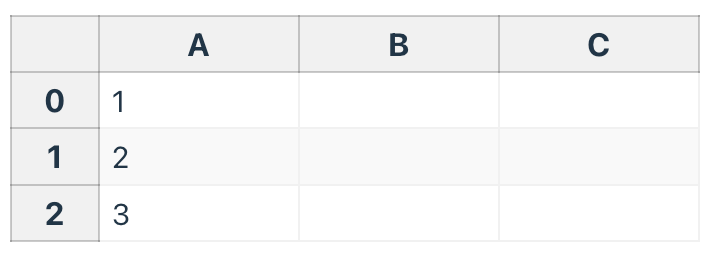
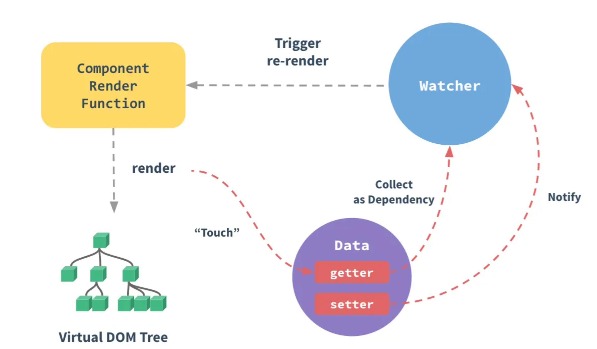

# 响应式原理开篇

`vue`框架带来的最大好处就是将数据和UI解耦，开发者不需要关注`dom`是如何渲染在页面上的，只需要按照`vue`提供的语法就可以实现数据动态的渲染在页面上。这里面非常重要的一环便是响应式更新。[`Vue`官网](https://cn.vuejs.org/guide/extras/reactivity-in-depth.html)中也提到`Vue` 最标志性的功能就是其低侵入性的响应式系统。组件状态都是由响应式的 JavaScript 对象组成的。当更改它们时，视图会随即自动更新。接下来我们会深入的了解到响应式是如何实现的。

## 什么是响应式

在探索源码之前，咱们先来聊一下**响应式**的概念。在**Vue官方文档**中写道：

> **响应性**是一种可以使我们声明式地处理变化的编程范式。



这里单元格 A2 中的值是通过公式 `= A0 + A1` 来定义的 (你可以在 A2 上点击来查看或编辑该公式)，因此最终得到的值为 3，正如所料。但如果你试着更改 A0 或 A1，你会注意到 A2 也随即自动更新了。

但是在`JavaScript`这样是不会生效的，我们必须要**定义式**的重新声明变量值才能够更改

```javascript
let A0 = 1
let A1 = 2
let A2 = A0 + A1

console.log(A2) // 3

A0 = 2
console.log(A2) // 仍然是 3
```

所以为了能够让我们的A2动态更新，我们可以定义一个函数，将A2的执行包裹起来，这个函数也就是我们后面会提到的副作用函数。

> 副作用函数也就是函数的运行会带来状态的改变，当运行完这个函数之后整个应用程序的状态和运行之前可能不一致，我们称之为产生了副作用。我们定义的`update`函数就行副作用函数，它的副作用是会造成A2变量的更改

```javascript
let A2
function update() {
  A2 = A0 + A1
}
```

但是光定义了函数不行还得运行，我们很容易想到，我们这个函数运行的时机是当A0和A1值发生变化的时候。所以我们还需要一个函数能够监听到A0和A1的变化。当他们发生变化的时候就会调用我们的副作用函数。

> `A0` 和 `A1` 被视为这个副作用的**依赖** (dependency)，因为在副作用中它们的值会被用来进行计算。由于副作用的运行**依赖**`A0` 和 `A1` ，因此这个副作用是`A0` 和 `A1` 的一个**订阅者** (subscriber)。

```javascript
whenDepsChange(update)
```

这个 `whenDepsChange()` 函数有如下的任务：

1. 当一个变量被读取时进行追踪。例如我们执行了表达式 `A0 + A1` 的计算，则 `A0` 和 `A1` 都被读取到了。
2. 如果一个变量在当前运行的副作用中被读取了，就将该副作用设为此变量的一个订阅者。例如由于 `A0` 和 `A1` 在 `update()` 执行时被访问到了，则 `update()` 需要在第一次调用之后成为 `A0` 和 `A1` 的订阅者。
3. 探测一个变量的变化。例如当我们给 `A0` 赋了一个新的值后，应该通知其所有订阅了的副作用重新执行。

`Vue`响应式原理思想和这个类似，我们的组件渲染/watch/computed都会产生一个副作用函数（类比于上述`update`），我们用`ref`等定义的变量是这些副作用函数的依赖（类比A0，A1），当我们的变量发生更新的时候会依次调用依赖了这些变量的副作用函数，从而实现了我们响应式的效果

## Vue2的响应式实现



图来自官方文档，从图中我们能够看到：**初始化时对状态数据做了劫持，在执行组件的`render`函数时，会访问一些状态数据，就会触发这些状态数据的`getter`，然后`render`函数对应的`render watcher`就会被这个状态收集为依赖，当状态变更触发`setter`，`setter`中通知`render watcher`更新，然后`render`函数重新执行以更新组件。** 就这样完成了响应式的过程。

Vue2中通过`Object.defineProperty`给每个属性设置`getter`、`setter`来进行数据的劫持和更新的通知，他的特点如下：

1. `Object.defineProperty`是通过给对象新增属性/修改现有属性 来实现数据的劫持。需要遍历对象的每一个`key`去实现，当遇到很大的对象或者嵌套层级很深的对象，性能问题会很明显。
2. `Object.defineProperty`这种方式无法拦截到给对象新增属性这种操作，因为组件初始化不能预知会新增哪些属性，也就没法设置`getter/setter`，所以我们不得不使用`Vue2`提供的`$set`api，再去`Object.defineProperty`给新增的属性加上`getter/setter`。
3. `Object.defineProperty`支持`IE`，兼容性较好。

正是因为第三点，因此`Vue2`才使用`Object.defineProperty`去实现数据的劫持，即便它有很多缺点。

## Vue3的响应式实现

`Vue3`响应式的实现原理和`Vue2`大致相同，区别主要在于数据劫持的实现方式上，在`Vue3`中完全抛弃了[getter](https://developer.mozilla.org/en-US/docs/Web/JavaScript/Reference/Functions/get) / [setters](https://developer.mozilla.org/en-US/docs/Web/JavaScript/Reference/Functions/set) 的方式，采用了[Proxy](https://developer.mozilla.org/en-US/docs/Web/JavaScript/Reference/Global_Objects/Proxy)来进行属性的劫持，虽然`IE`对`proxy`不支持，但是都这年头了，`IE`已经是时代的弃子了，能不管就不管了吧。

## 小结

这个章节完全没有涉及源码，旨在让大家对响应式的运行流程有一个初步的认识，接下来我们会从源码的角度来讲解`vue3`响应式原理的具体实现，主要源码不会过于深入，主要是为了让大家对各个函数的职责有大概了解，后续章节再深入各个函数具体的实现。在此之前我们需要了解一些主要的概念：

::: tip
响应式相关的所有代码都位于`packages/reactivity`目录下，文章所有的源码都已经精简，只保留了最核心部分，完整代码请读者自行查看源码。
::: 

