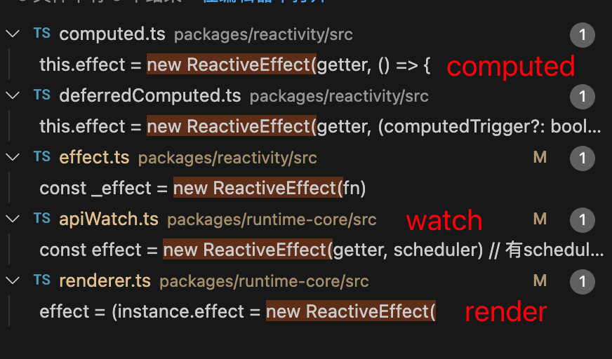

# reactiveEffect

前面我们已经了解到了`vue`响应式的整个流程了，我们在访问某个属性的时候会触发`track`收集当前副作用，当这个属性发生更改的时候我们会触发`trigger`进行副作用的调用，这整个机制我们已经了解的非常清楚了，那么这个副作用到底是什么呢。

在`vue`中一共会有三个地方会产生副作用。组件渲染`render`，`watch`函数，`computed`函数。这个也是符合我们认知的。在这三个函数实现的地方都会调用`new ReactiveEffect()`来实例化副作用



接下来我们就重点关注`ReactiveEffect`这个类。

```js
export class ReactiveEffect<T = any> {
  active = true // 当前effect是不是活跃的。调用stop就会停止工作
  deps: Dep[] = [] // 这个副作用所依赖的响应式副作用
  parent: ReactiveEffect | undefined = undefined // 父effect，因为effect可以嵌套
  computed?: ComputedRefImpl<T> // 是不是computer
  allowRecurse?: boolean // 是否允许递归收集依赖
  private deferStop?: boolean // 是否需要异步停止
  onStop?: () => void // 暂停的回调函数
  onTrack?: (event: DebuggerEvent) => void // 开发环境用
  onTrigger?: (event: DebuggerEvent) => void // 开发环境用

  constructor(
    public fn: () => T,
    public scheduler: EffectScheduler | null = null, // 调度函数
    scope?: EffectScope // effect作用域
  ) {
    recordEffectScope(this, scope)
  }

  /**
   * 
   * 保存当前activeEffect对象和收集状态
   * 标记当前所有已经存在的依赖为已收集
   * 调用fn回调收集依赖，这些依赖被标记为新收集
   * 将被标记为已收集但不是新收集的依赖移除掉
   * 还原activeEffect对象和收集状态
   */
  run() {
    // 未激活，直接调用fn回调，没有依赖收集
    if (!this.active) {
      return this.fn()
    }
    let parent: ReactiveEffect | undefined = activeEffect
    let lastShouldTrack = shouldTrack // 保存上一个副作用的的变量，副作用会嵌套

    // 遍历激活的reactiveEffect链，如果自身已经存在于链中，则退出，避免无限递归
    while (parent) {
      if (parent === this) {
        return
      }
      parent = parent.parent
    }
    try {
      // 设置父activeEffect对象
      this.parent = activeEffect
      activeEffect = this // 设置当前effect为全局的副作用函数
      shouldTrack = true

      trackOpBit = 1 << ++effectTrackDepth

      if (effectTrackDepth <= maxMarkerBits) { // 依赖收集优化
        initDepMarkers(this)
      } else {
        cleanupEffect(this)
      }
      return this.fn() // 这里就算return了最后也会执行到finally的语句里面去，而且finally return会覆盖try里面的内容
    } finally {
      if (effectTrackDepth <= maxMarkerBits) {
        // 处理最终依赖
        finalizeDepMarkers(this)
      }

      // 回退到上一个状态
      trackOpBit = 1 << --effectTrackDepth

      activeEffect = this.parent
      shouldTrack = lastShouldTrack
      this.parent = undefined

      if (this.deferStop) {
        this.stop()
      }
    }
  }

  // 停止依赖收集，将ReactiveEffect对象设置为未激活，如果对象是activeEffect对象，则表明当前正在收集依赖，则转换为异步停止。
  stop() {
    // stopped while running itself - defer the cleanup
    if (activeEffect === this) { // 判断现在这个effect是不是正在进行依赖收集，正在收集要等收集完再触发
      // 异步停止收集依赖
      this.deferStop = true
    } else if (this.active) {
      // 清理依赖，将effect从对应的响应式属性中删除
      cleanupEffect(this)
      if (this.onStop) {
        // 调用回调
        this.onStop()
      }
      // 激活状态设置为false
      this.active = false
    }
  }
```

`ReactiveEffect`中我们主要关注`run`和`stop`两个函数，run`的作用就是用来执行副作用函数`fn`，并且在执行过程中进行**依赖收集**，`stop`用来停止当前`effect`的工作。

## run

`run`的主要工作如下：

1. 如果当前`effect`实例是不工作状态，就仅仅执行一下`fn`，不需要收集依赖。
2. 判断当前的`effect`链是否死循环

2. 由于在一个`effect.run`的过程中可能会触发另外的`effect.run`, 暂存上一次的`activeEffect、shouldTrack`，目的是为了本次执行完以后把`activeEffect、shouldTrack`恢复回去。

3. 设置`activeEffect`为当前副作用、设置shouldTrack`。

4. `effectTrackDepth`自增，`trackOpBit` 更新为 `1 << effectTrackDepth`。其中`effectTrackDepth`是一个全局变量，表示当前嵌套调用 `effect.run` 的深度。用来做依赖收集优化的。

5. 执行`fn()`。

6. 在`finally`中进行状态还原，并且确定这个副作用最终的依赖状况。

7. 如果`deferStop` 为 `true`，执行`stop`，可能在调用`stop`时，正在收集依赖，因此推迟到本次收集完成再`stop`。防止`stop`太早后面依赖没有删除干净。

可以看到，在`run`中其实主要就是调用了`fn`去执行副作用。

## 依赖收集优化

在`run`和之前`track`的时候我们看到了两个变量这两个变量是用来做收集优化的

```js
let effectTrackDepth = 0 // 当前依赖的层级
export let trackOpBit = 1 // 当前依赖层级对应的二进制的值，可以方便我们快速知道对应的层级
```

### 前置知识

1. **首先我们需要知道依赖可以嵌套的**

```vue
<!-- Index.vue -->
<template>
  <Parent />
</template>

<!-- Parent.vue -->
<template>
  <Child />
</template>

<!-- Child.vue -->
<template>
  <div></div>
</template>
```

例如上述的组件，由于我们渲染的时候递归遍历所有的子组件，而且每个组件都会产生一个副作用，所以渲染上面`index.vue`的时候会生成三个副作用。

```bash
indexEffect -> ParentEffect -> ChildEffect
```

2. 其次，我们需要知道每个副作用的依赖是会动态变化的，也就是说`effect.run`会调用很多次，每一次我们都需要重新收集依赖。例如下面这个例子，刚开始`watch`只依赖`flag、obj`，当`flag`为`true`的时候，我们会重新执行`watch `副作用的`run`函数。这时候收集到的依赖为`flag、obj2`。

```js
const obj = ref({});
const obj2 = ref({});
const flag = ref(false);
watch(() => {
  if (flag.value) {
    console.log(obj.value);
  } else {
    console.log(obj2.value);
  }
})
```

### 依赖优化思考

由于依赖会产生更新，那么我们处理更新呢。首先想到的暴力办法就是上一次收集到的依赖全部删除，然后再添加新的。**考虑到全部清除 & 重新收集损耗更多性能，因此就有了优化的收集方案——打标记**具体是怎么做的呢。

以上面嵌套组件为例，我们会有`indexEffect -> ParentEffect -> ChildEffect`这条副作用链。每嵌套一层我们都会执行

```js
trackOpBit = 1 << ++effectTrackDepth
```

把嵌套层数加1，`trackOpBit`在对应层级标记为1。方便后面做二进制运算。所以上面`effect`对应的`effectTrackDepth、trackOpBit`如下。

```js
indexEffect effectTrackDepth = 1， trackOpBit = 2 (对应二进制10)
ParentEffect effectTrackDepth = 2， trackOpBit = 4 (对应二进制100)
ChildEffect effectTrackDepth = 3， trackOpBit = 8 (对应二进制1000)
```

可以看到，我们`trackOpBit`中的每一位代表着对应的层级，我们可以通过 & 运算很快的知道是不是在当前层级。这个和`react`的`lane`有异曲同工之妙。**注意：**我们嵌套的最深层级为`maxMarkerBits = 30`层。超过了三十层就采用最暴力的办法，调用`cleanupEffect`清除之前的，全都用这次收集的。

::: tip
为什么最大是30？因为在js中number中使用32位的二进制数来表示数字的，第32位是符号位（0为正，1为负），那就是说最多能表示31个状态，而在trackOpBit中最后一位没有使用，第一次进去是使用1 << 1，直接从第二位开始的。所以最大的层数只能是30。
::: 

### 打标记具体实现

有了上述知识后我们再看具体是怎么优化的。

```js
if (effectTrackDepth <= maxMarkerBits) { // 依赖收集优化
	initDepMarkers(this) // 初始化当前依赖
} else {
	cleanupEffect(this) // 超过了直接清除之前的
}
```

在执行`fn`之前，我们会先调用`initDepMarkers`进行依赖的初始化

```js
export const initDepMarkers = ({ deps }: ReactiveEffect) => {
  if (deps.length) {
    for (let i = 0; i < deps.length; i++) {
      deps[i].w |= trackOpBit // set was tracked
    }
  }
}
```

还记得我们在`dep`的时候讲到每个`dep`会有两个属性，一个是`w`表示这个`dep`已经被收集(因为通过`trackOpBit`我们可以知道现在是在哪一层副作用，如果`trackOpBit` & `dep.w`大于0说明在当前副作用下，这个`dep`已经被收集了 )。一个是`n`表示这个`dep`是新被收集到的（同样也是执行`trackOpBit` & `dep.w`）。接着看`initDepMarkers`函数，实现非常简单，就是获取到上一次收集到的`dep`，然后将所有`dep`都标记为已经收集了。

初始化好了之后我们在执行`fn`，在`fn`里面访问对应的响应式属性就会触发`trackEffect`。

```js
// 是不是已经被收集了
export const wasTracked = (dep: Dep): boolean => (dep.w & trackOpBit) > 0
// 是不是新收集的
export const newTracked = (dep: Dep): boolean => (dep.n & trackOpBit) > 0

export function trackEffects(
  dep: Dep,
  debuggerEventExtraInfo?: DebuggerEventExtraInfo
) {
  let shouldTrack = false
  if (effectTrackDepth <= maxMarkerBits) {
    // 是否已经被新收集
    if (!newTracked(dep)) {
      // 当前依赖打上新增标识
      dep.n |= trackOpBit // set newly tracked 当前副作用是这一次被新收集的
      shouldTrack = !wasTracked(dep) // 当前副作用在上一次就收集了，为了优化我们这一次不处理
    }
  } else {
    shouldTrack = !dep.has(activeEffect!) // 判断是否还需要收集,因为在fn中一个响应式属性可以多次访问，只用收集第一次
  }

  if (shouldTrack) {
    // 添加依赖操作
  }
}
```

可以看到，首先对于`effectTrackDepth > maxMarkerBits`的情况，我们只需要判断`dep`里面是不是已经收集过了就行。

对于`effectTrackDepth <= maxMarkerBits`可以优化的情况，我们就判断在这一次收集中当前副作用是不是已经被`收集了`。没有收集我们就打上`n`标记，然后判断当前副作用在上一次是不是已经被收集，如果已经被收集了我们就不需要重新收集了，`shouldTrack`为`false`。

执行完`fn`之后我们就会调用`finalizeDepMarkers`进行最后的依赖处理。

```js
// 更新当前effect函数所依赖的数据。因为有些可能在收集过程中断开了这个依赖，所以需要去掉
export const finalizeDepMarkers = (effect: ReactiveEffect) => {
  const { deps } = effect
  if (deps.length) {
    let ptr = 0
    for (let i = 0; i < deps.length; i++) {
      const dep = deps[i]
      if (wasTracked(dep) && !newTracked(dep)) { // 之前依赖了现在没依赖的项，我们需要去掉
        dep.delete(effect)
      } else {
        deps[ptr++] = dep // 其它的都是我们需要的依赖
      }
      // clear bits 当前层级的effect已经处理完了。 还原到之前的状态
      dep.w &= ~trackOpBit
      dep.n &= ~trackOpBit
    }
    deps.length = ptr // 更新length
  }
}
```

我们可以看到最终是通过`dep`的`w、n`来确定我们这一次收集到的依赖的去留。这样我们就只需要去掉之前多余收集的和添加这次新收集的到，而不用这一次和上一次都有的依赖多进行一次添加和删除的操作，优化了性能。而且一般嵌套层级也不会超过30，所以还是挺有用的。

执行完`finalizeDepMarkers`我们还需要还原`effectTrackDepth、trackOpBit`。恢复到父亲的副作用。

## stop

`stop`执行后会将 `effect.active` 变为`false`，并且调用`cleanupEffect` 删除`effect.deps`，其作用就是为了让一个`effect`对象不再工作，因为当`effect`为`false`，不再会收集依赖，并且`deps`已经并删除，不再会触发`effect.run`。通常是在销毁之前调用这个`stop`。

```js
// 停止依赖收集，将ReactiveEffect对象设置为未激活，如果对象是activeEffect对象，则表明当前正在收集依赖，则转换为异步停止。
  stop() {
    // stopped while running itself - defer the cleanup
    if (activeEffect === this) { // 判断现在这个effect是不是正在进行依赖收集
      // 异步停止收集依赖
      this.deferStop = true
    } else if (this.active) {
      // 清理依赖
      cleanupEffect(this)
      if (this.onStop) {
        // 调用回调
        this.onStop()
      }
      // 激活状态设置为false
      this.active = false
    }
  }
```

要注意如果当前副作用正在执行的话，我我们要等执行完之后再调用`stop`函数，防止我们执行了`stop`但是副作用又还在运行添加了新的依赖没被我们处理掉。

## 小结

了解完`reactiveEffect`之后我们就完全掌握了响应式原理。这里我以`render`渲染函数为例再给大家梳理下主要流程：

```js
const effect = (instance.effect = new ReactiveEffect(
      componentUpdateFn,
      () => queueJob(update),
      instance.scope  // 3. 在组件的作用范围内收集这个响应式副作用对象作为依赖。
    )) 
```

在`render`中我们调用`reactiveEffect`实例了一个副作用对象。然后调用副作用的`run`将全局的`activeEffect`置为当前副作用。在`run`中我们会调用我们传入的`componentUpdateFn`函数，在`componentUpdateFn`我们会访问响应式变量，然后就会触发这个变量的`track`，会将当前回作用添加到这个变量的`dep`中去。之后当我们的响应式变量发生变化会触发`trigger`函数，会遍历这个响应式变量的`dep`(里面存的是副作用)，然后调用这个副作用。如此往复，构造了整个`vue`的响应式原理

当然我们这里略过了调度器相关的内容，会在后面在详细讲解。

